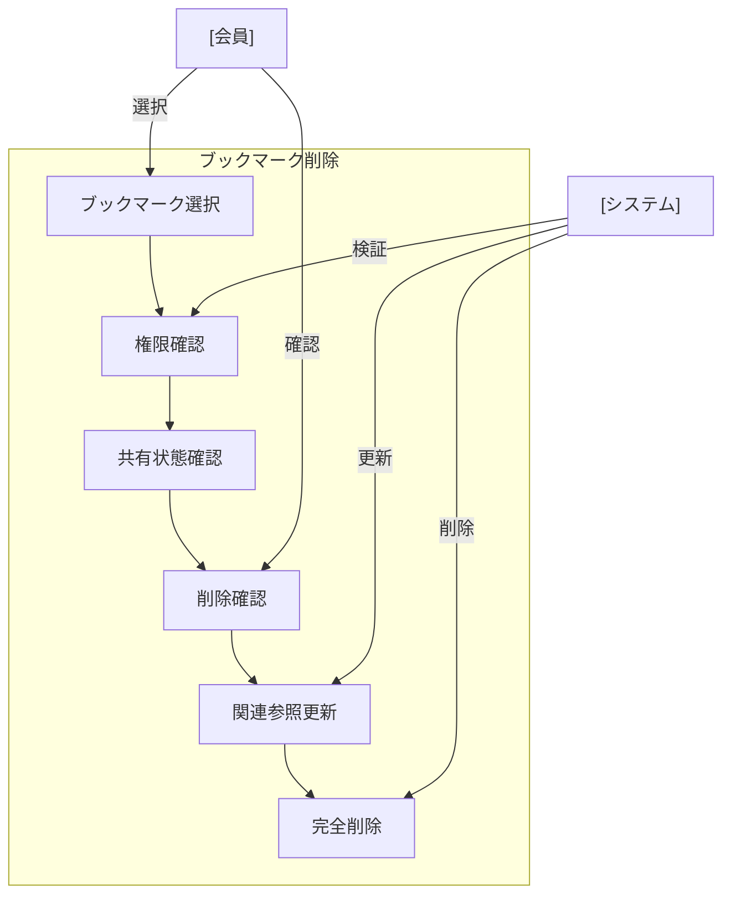

# ブックマーク削除

## ユースケース概要

既存のブックマークを安全に削除する機能を提供します。共有されているブックマークの場合、適切な権限チェックと関連する参照の処理を行います。

## アクター

- [会員] - ブックマークを削除する一般ユーザー
- [システム] - ブックマーク情報を処理するシステム

## 事前条件

- 会員としてログインしていること
- 削除対象のブックマークが存在すること
- ブックマークの削除権限があること（作成者またはグループ管理者）

## 想定シナリオ

[古いブックマークの整理]

鈴木さん（29歳、プロジェクトマネージャー）は、チームで共有しているブックマークコレクションの棚卸しを行うことにしました。

プロジェクトの進行に伴い、既に不要となった参考資料や、リンク切れとなった技術記事のブックマークが増えていることに気づきました。

まず、各ブックマークの最終アクセス日と有効性を確認し、チームメンバーに確認の上、不要なものを特定しました。その後、一括削除機能を使用して整理を行いました。

この作業により、ブックマークの管理効率が向上し、チームメンバーが必要な情報により素早くアクセスできるようになりました。検索結果のノイズも減少し、情報探索時間が平均40%短縮されました。

## 基本フロー

1. [会員]は削除対象のブックマークを選択
2. [システム]は削除確認ダイアログを表示
3. [システム]は以下の情報を表示：
   - ブックマークの基本情報
   - 共有状態
   - 関連する参照数
4. [会員]は削除を確認
5. [システム]は関連する参照を更新
6. [システム]はブックマークを削除
7. [システム]は完了メッセージを表示

## 代替フロー

### 共有されているブックマークの場合

2a. [システム]は共有メンバーを表示
2b. [システム]は影響範囲を警告
2c. [会員]は共有メンバーに通知を送信可能

### 複数ブックマークの一括削除

1a. [会員]は複数のブックマークを選択
1b. [システム]は一括削除の確認を要求
1c. [会員]は確認後に進める

## 例外フロー

### 削除権限がない場合

1a. [システム]は権限エラーを表示
1b. [会員]は権限リクエストを送信可能

## 事後条件

- ブックマークが削除されている
- 関連する参照が更新されている
- 必要に応じて共有メンバーに通知されている
- 削除ログが記録されている

## 関連オブジェクト

- ブックマーク
  - ID
  - URL
  - タイトル
  - 共有設定
  - 作成者
  - 作成日時
  - 最終アクセス日時
  - 参照数

## 補足情報

### 削除時の考慮事項

1. データの整合性
   - 関連する参照の更新
   - インデックスの更新
   - キャッシュの更新

2. 共有と通知
   - 共有メンバーへの通知
   - グループ管理者への通知
   - 削除履歴の記録

3. 復元対策
   - 削除の取り消し期間（30日）
   - バックアップの保持
   - 復元手順の提供