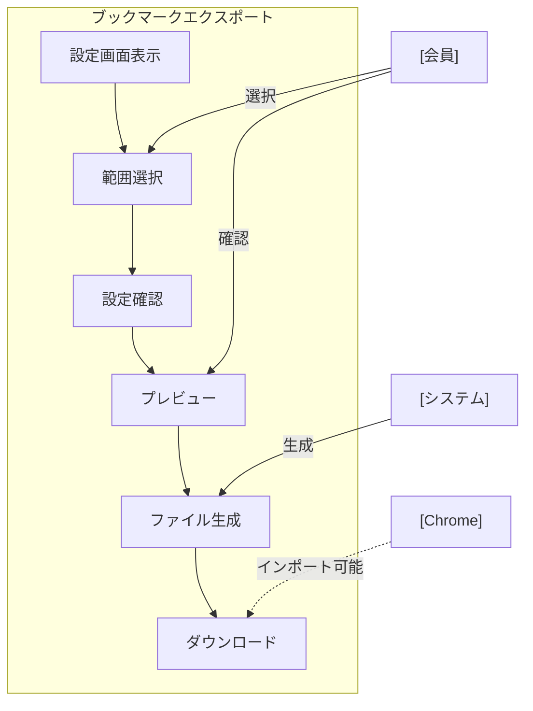

# ブックマークエクスポート

## ユースケース概要

システムに保存されているブックマークをChrome互換のHTMLファイル形式でエクスポートする機能を提供します。フォルダ構造を保持し、選択的なエクスポートにも対応します。

## アクター

- [会員] - ブックマークをエクスポートする一般ユーザー
- [システム] - ブックマーク情報を処理するシステム
- [Chrome] - エクスポートしたファイルのインポート先

## 事前条件

- 会員としてログインしていること
- エクスポート対象のブックマークが存在すること
- エクスポート権限があること（個人またはグループの所有者）

## 想定シナリオ

[プロジェクト資料の共有準備]

高橋さん（33歳、シニアエンジニア）は、プロジェクトで収集した技術資料のブックマーク（約200件）を、新規参加のチームメンバーが各自のブラウザで利用できるように準備することにしました。

システムのエクスポート機能を使用して、プロジェクト関連のフォルダを選択し、Chrome互換形式でエクスポートを行いました。エクスポート時には、フォルダ構造を維持しながら、プライベートなブックマークを除外するフィルタリングも活用しました。

作成されたファイルは新メンバーに配布され、各自のChromeブラウザに直接インポートすることができました。

この作業により、新メンバーのオンボーディング時間が大幅に短縮され、必要な技術資料への即時アクセスが可能になりました。以前は1週間かかっていた環境構築と資料確認が2日で完了するようになりました。

## 基本フロー

1. [会員]はエクスポート機能を選択
2. [システム]はエクスポート設定画面を表示
3. [会員]は以下の設定を行う：
   - エクスポート範囲の選択
   - フォルダの選択
   - プライバシー設定
   - 出力形式の選択
4. [システム]は選択内容を検証
5. [システム]はエクスポートプレビューを表示
6. [会員]はエクスポートを実行
7. [システム]はファイルを生成
8. [システム]はダウンロードを開始

## 代替フロー

### 一部のブックマークにアクセス権限がない場合

3a. [システム]は権限のない項目を表示
3b. [会員]は以下から選択：
    - スキップしてエクスポート
    - 権限リクエストを送信

### 大量データのエクスポート

6a. [システム]は処理時間の見積もりを表示
6b. [システム]は非同期処理を開始
6c. [システム]は完了時に通知

## 例外フロー

### エクスポート処理がタイムアウトした場合

7a. [システム]はエラーを表示
7b. [システム]は範囲を分割してのエクスポートを提案

## 事後条件

- 選択されたブックマークがエクスポートされている
- Chrome互換形式のファイルが生成されている
- エクスポートログが記録されている

## 関連オブジェクト

- エクスポート設定
  - 対象フォルダ
  - フィルター条件
  - プライバシー設定
  - 出力形式

- 出力ファイル
  - HTML形式
  - フォルダ構造情報
  - メタデータ

## 補足情報

### エクスポート処理の制限値

1. データ量
   - 1回あたりの最大件数：1000件
   - ファイル最大サイズ：10MB
   - フォルダ最大深度：5

2. 形式
   - HTML（Chrome互換）
   - JSON（システムバックアップ用）
   - CSV（表計算ソフト用）

3. 処理時間
   - 同期処理の制限：30秒
   - 非同期処理の制限：10分