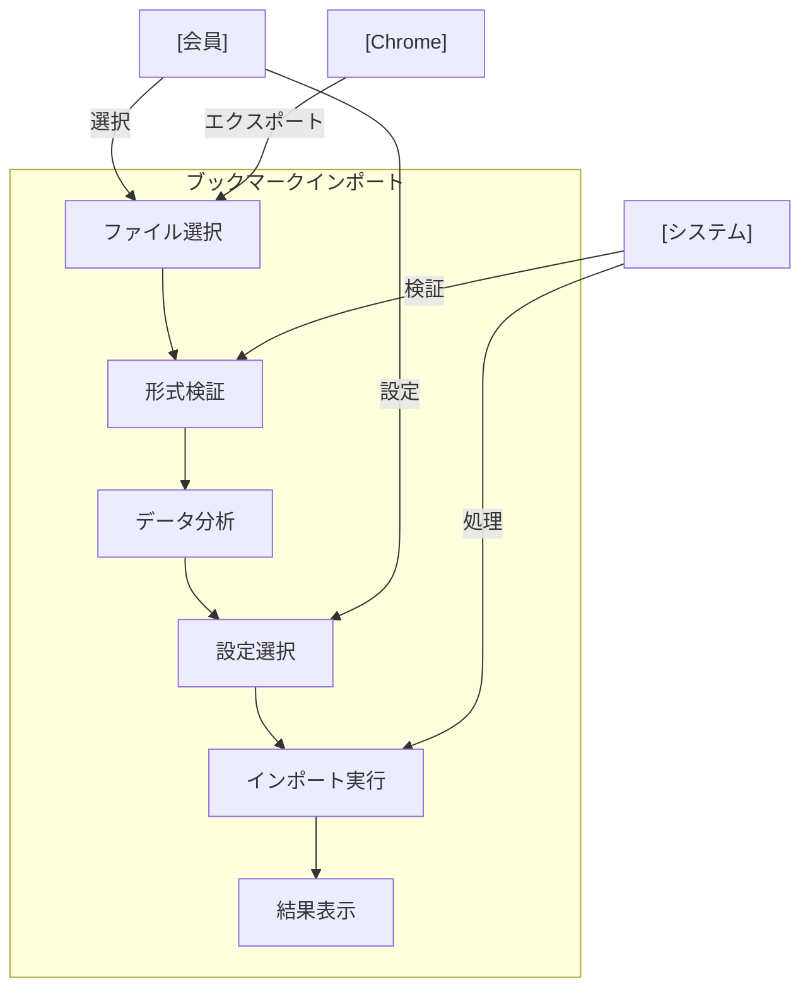

# ブックマークインポート

## ユースケース概要

Chromeブラウザからエクスポートしたブックマークデータをシステムにインポートする機能を提供します。フォルダ構造を保持しながら、既存のブックマークとの重複も適切に処理します。

## アクター

- [会員] - ブックマークをインポートする一般ユーザー
- [システム] - ブックマーク情報を処理するシステム
- [Chrome] - インポート元のブラウザ

## 事前条件

- 会員としてログインしていること
- ChromeからエクスポートしたHTMLファイルがあること
- インポート先のフォルダに十分な容量があること

## 想定シナリオ

[ブラウザブックマークの移行]

木村さん（31歳、ウェブデベロッパー）は、長年Chromeで収集してきた開発関連のブックマーク（約500件）を、チームで共有できる形に移行したいと考えていました。

まず、Chromeのブックマーク管理画面からHTMLファイルとしてエクスポートを行いました。その後、システムのインポート機能を使用して、フォルダ構造を保持したままデータを取り込みました。

インポート時には重複チェックが行われ、既存のブックマークとの統合方法を選択できました。また、カテゴリやタグの一括設定機能を使用して、効率的にメタデータを付与しました。

結果として、2時間程度の作業で全てのブックマークが整理され、チームメンバーと共有可能な状態になりました。以前は個人での管理だった技術情報が、チーム全体の資産として活用できるようになりました。

## 基本フロー

1. [会員]はインポート機能を選択
2. [システム]はインポートフォームを表示
3. [会員]はChromeからエクスポートしたファイルを選択
4. [システム]はファイルの形式を検証
5. [システム]は以下の情報を表示：
   - インポート対象件数
   - フォルダ構造
   - 重複するURL数
6. [会員]はインポート設定を行う：
   - 重複時の処理方法
   - カテゴリの一括設定
   - タグの一括設定
   - フォルダの配置先
7. [システム]はインポートを実行
8. [システム]は結果サマリーを表示

## 代替フロー

### 重複するURLがある場合

5a. [システム]は重複項目のリストを表示
5b. [会員]は以下から処理方法を選択：
    - スキップ
    - 上書き
    - 新規作成
    - マージ

### フォルダ階層が深すぎる場合

7a. [システム]は階層の制限（最大5階層）を警告
7b. [会員]は階層構造の自動調整を選択可能

## 例外フロー

### ファイル形式が不正な場合

4a. [システム]はエラーを表示
4b. [会員]は正しい形式のファイルを選択

## 事後条件

- ブックマークがインポートされている
- フォルダ構造が作成されている
- 重複が適切に処理されている
- インポートログが記録されている

## 関連オブジェクト

- インポートファイル
  - HTMLファイル形式
  - ブックマークデータ構造
  - フォルダ階層情報

- インポート設定
  - 重複処理方法
  - デフォルトカテゴリ
  - デフォルトタグ
  - フォルダマッピング

## 補足情報

### インポート処理の制限値

1. ファイル
   - 最大サイズ：10MB
   - 形式：HTML

2. データ量
   - 1回あたりの最大件数：1000件
   - フォルダ最大深度：5
   - URL最大長：2048文字

3. 処理時間
   - タイムアウト：5分
   - 非同期処理：対応