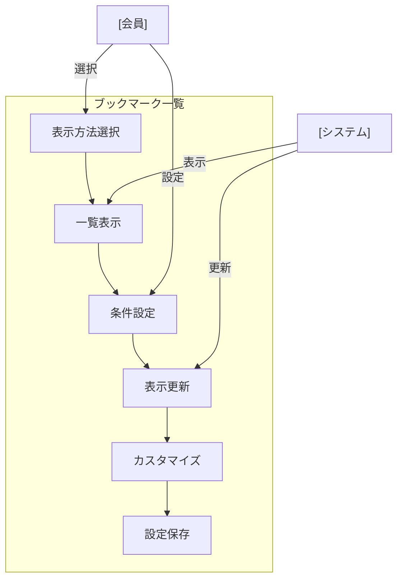

# ブックマーク一覧表示

## ユースケース概要

保存されているブックマークを一覧表示し、効率的な閲覧と管理を可能にする機能を提供します。フォルダ構造での表示、ソート機能、フィルタリング機能を含みます。

## アクター

- [会員] - ブックマーク一覧を閲覧する一般ユーザー
- [システム] - 一覧表示機能を提供するシステム

## 事前条件

- 会員としてログインしていること
- 表示対象のブックマークへのアクセス権限があること

## 想定シナリオ

[チーム共有リソースの管理]

伊藤さん（30歳、チームリード）は、チームで共有している技術リソースの整理状況を確認するため、ブックマーク一覧機能を使用することにしました。

フォルダツリービューで全体構造を確認しながら、最近追加されたブックマークを日付順にソートして表示。さらに、未分類のブックマークをフィルタリングして、カテゴリやタグの設定漏れをチェックしました。

一覧のカスタムビュー機能を使用して、「最近追加」「未分類」「重要」などの表示パターンを保存。定期的なメンテナンス作業を効率化しました。

この作業により、チーム全体のナレッジ管理が改善され、新規参加者でも必要な情報に素早くアクセスできるようになりました。情報の整理状態の可視化により、メンテナンス作業の工数が週1時間から月1時間に削減されました。

## 基本フロー

1. [会員]はブックマーク一覧を表示
2. [システム]は以下の表示オプションを提供：
   - フォルダツリービュー
   - リストビュー
   - グリッドビュー
3. [会員]は表示方法を選択
4. [システム]は選択に応じて表示を更新
5. [会員]はソート・フィルター条件を設定：
   - 日付順
   - タイトル順
   - アクセス数順
   - カテゴリ/タグフィルター
6. [システム]は条件に応じて表示を更新
7. [会員]は必要に応じて表示をカスタマイズ

## 代替フロー

### カスタムビューの保存

5a. [会員]は現在の表示設定を保存
5b. [システム]はビュー名の入力を要求
5c. [会員]は名前を付けて保存

### バルク操作の実行

7a. [会員]は複数アイテムを選択
7b. [システム]は一括操作メニューを表示：
    - カテゴリ設定
    - タグ付与
    - フォルダ移動
    - 削除

## 例外フロー

### アクセス権限の変更があった場合

4a. [システム]はアクセス不可項目を非表示
4b. [システム]は権限の変更を通知

## 事後条件

- 選択された表示方法でブックマークが表示されている
- ソート・フィルター条件が適用されている
- カスタム表示設定が保存されている（該当する場合）

## 関連オブジェクト

- 表示設定
  - 表示方法（ツリー/リスト/グリッド）
  - ソート条件
  - フィルター条件
  - カスタムビュー設定

- リストアイテム
  - タイトル
  - URL
  - カテゴリ
  - タグ
  - 更新日時
  - アクセス数
  - 共有状態

## 補足情報

### 表示機能の特徴

1. パフォーマンス最適化
   - 仮想スクロール
   - 遅延読み込み
   - リアルタイム更新

2. 表示オプション
   - リスト密度調整
   - 列表示カスタマイズ
   - クイックプレビュー

3. 操作性向上
   - ドラッグ＆ドロップ
   - キーボードショートカット
   - コンテキストメニュー
   - マルチセレクト