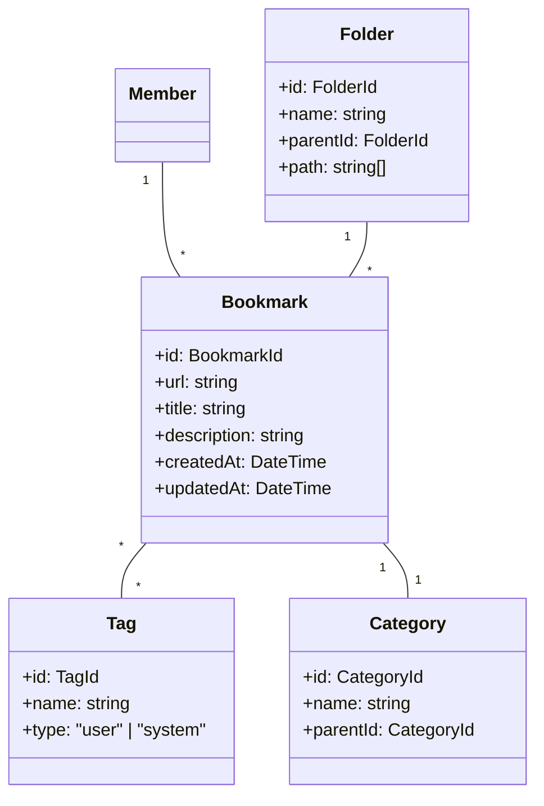
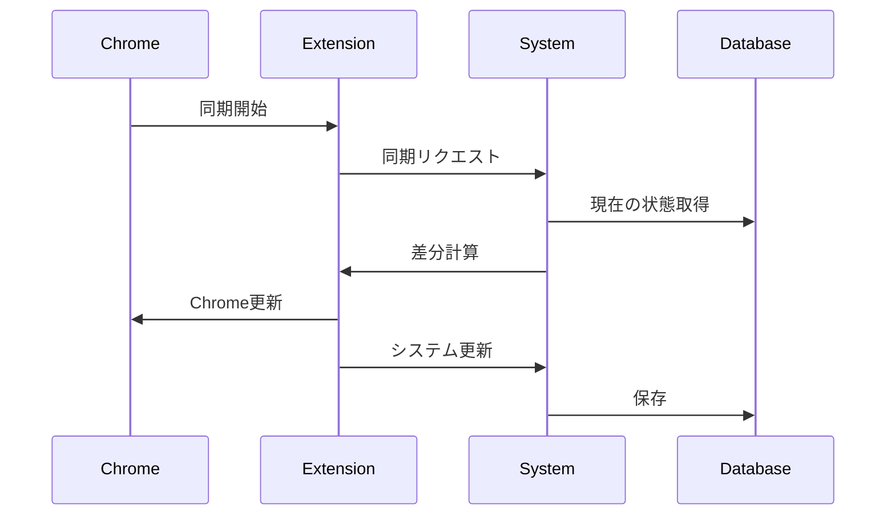

# ブックマーク管理ユースケース

## ユースケース概要

会員がウェブページのブックマークを作成、整理、管理するためのユースケース。

## アクター

- [会員]
- [Chrome拡張]
- [システム]

## 事前条件

- アカウントが有効であること
- ログイン済みであること

## 基本フロー

### シナリオ：研究資料のブックマーク整理

研究者の鈴木一郎は、最新の論文やテクニカルブログをブックマークし、研究テーマごとに整理しようとしています。

1. [会員]はChromeで研究関連のページを閲覧
2. [Chrome拡張]の(BookmarkButton)をクリック
3. [システム]は(BookmarkForm)を表示
4. [会員]はブックマーク情報を入力
   - タイトル
   - 説明
   - フォルダ選択
   - タグ付け
   - カテゴリ選択
5. [システム]は(ValidationService)で入力を検証
6. [システム]は(BookmarkManager)で保存を実行
7. [システム]は(IndexingService)でコンテンツをインデックス化
8. [システム]は完了を通知

## 代替フロー

### A1. フォルダ作成

4a. [会員]は新しいフォルダを作成
5a. [システム]は(FolderManager)でフォルダを作成
6a. 基本フローの4に戻る

### A2. Chrome同期

1a. [会員]はChrome同期を実行
2a. [Chrome拡張]は(SyncService)を呼び出し
3a. [システム]は重複をチェック
4a. [システム]は新規ブックマークを追加

## 例外フロー

### E1. 重複ブックマーク

6e. [システム]は重複を検出
7e. [システム]は(DuplicateHandler)で処理
   - 上書き
   - マージ
   - キャンセル

### E2. 無効なURL

5e. [システム]はURL検証エラーを検出
6e. [システム]は[会員]にエラーを通知
7e. 基本フローの4に戻る

## 事後条件

- ブックマークが保存されていること
- インデックスが更新されていること
- フォルダ構造が維持されていること

## 関連オブジェクト

- (Bookmark): ブックマーク情報
- (Folder): フォルダ情報
- (Tag): タグ情報
- (Category): カテゴリ情報
- (SyncService): 同期サービス
- (IndexingService): 検索インデックス
- (BookmarkManager): ブックマーク管理

## 補足資料

### データモデル



### バリデーションルール

1. ブックマーク
   - URLの有効性
   - タイトル：1-200文字
   - 説明：0-1000文字

2. フォルダ
   - 名前：1-100文字
   - 深さ：最大5階層
   - 1フォルダあたりの上限：1000件

### イベント定義

```typescript
type BookmarkEvent = {
    type: "CREATE" | "UPDATE" | "DELETE" | "MOVE";
    bookmarkId: BookmarkId;
    timestamp: DateTime;
    data: {
        url?: string;
        title?: string;
        folderId?: FolderId;
        tags?: TagId[];
        categoryId?: CategoryId;
    };
    metadata: {
        source: "web" | "chrome" | "api";
        sync?: boolean;
    };
};
```

### 同期プロセス



### UI コンポーネント

```mermaid
graph TD
    Toolbar["ツールバー"]
    Form["ブックマークフォーム"]
    Tree["フォルダツリー"]
    TagList["タグリスト"]
    
    Toolbar --> NewBookmark["新規作成"]
    Toolbar --> Import["インポート"]
    Toolbar --> Export["エクスポート"]
    
    Form --> URLInput["URL入力"]
    Form --> TitleInput["タイトル編集"]
    Form --> FolderSelect["フォルダ選択"]
    Form --> TagInput["タグ入力"]
    Form --> CategorySelect["カテゴリ選択"]