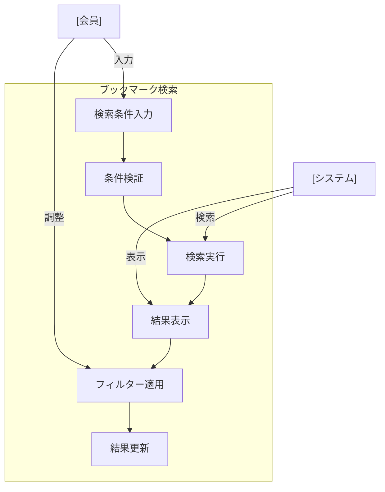

# ブックマーク検索

## ユースケース概要

保存されているブックマークを、様々な条件（タグ、カテゴリ、フォルダ、キーワードなど）で検索する機能を提供します。高度な検索オプションと、関連ブックマークの推薦機能も含みます。

## アクター

- [会員] - ブックマークを検索する一般ユーザー
- [システム] - 検索機能を提供するシステム

## 事前条件

- 会員としてログインしていること
- 検索対象のブックマークが存在すること
- 検索対象へのアクセス権限があること

## 想定シナリオ

[プロジェクトの技術調査]

中村さん（27歳、バックエンドエンジニア）は、新規プロジェクトでGraphQLを採用するか検討するため、チーム内で共有されているGraphQL関連の技術情報を探すことにしました。

検索機能を使用して、まず「GraphQL」タグが付いているブックマークを検索し、さらにカテゴリを「パフォーマンス」に絞り込みました。検索結果は更新日時でソートし、最新の情報から確認していきました。

また、検索結果の「関連ブックマーク」セクションから、APIデザインやスキーマ設計に関する追加の参考資料も発見できました。

結果として、30分程度の検索で必要な情報を網羅的に収集でき、技術選定の判断材料を効率的に集めることができました。以前は同様の調査に半日以上かかっていました。

## 基本フロー

1. [会員]は検索機能を起動
2. [システム]は検索フォームを表示
3. [会員]は以下の検索条件を設定：
   - キーワード
   - タグ（複数選択可）
   - カテゴリ
   - フォルダ
   - 日付範囲
   - 作成者
4. [システム]は検索を実行
5. [システム]は検索結果を表示：
   - 一致するブックマーク
   - 関連するブックマーク
   - フィルターオプション
6. [会員]は結果を確認
7. [会員]は必要に応じて条件を調整

## 代替フロー

### 高度な検索オプションの使用

3a. [会員]は高度な検索を選択
3b. [システム]は追加のオプションを表示：
    - 正規表現
    - 除外キーワード
    - AND/OR条件
    - ドメイン指定

### 保存済み検索条件の使用

1a. [会員]は保存済みの検索条件を選択
1b. [システム]は条件を読み込んで検索を実行

## 例外フロー

### 検索結果が0件の場合

4a. [システム]は「結果なし」を表示
4b. [システム]は類似の検索条件を提案
4c. [会員]は条件を調整して再検索

## 事後条件

- 検索結果が表示されている
- 検索履歴が更新されている
- 関連ブックマークが表示されている

## 関連オブジェクト

- 検索条件
  - キーワード（全文検索）
  - タグ（複数選択）
  - カテゴリ（単一選択）
  - フォルダ
  - 日付範囲
  - 作成者
  - 高度なオプション

- 検索結果
  - ブックマーク一覧
  - フィルターオプション
  - ソートオプション
  - 関連ブックマーク

## 補足情報

### 検索機能の特徴

1. インデックス
   - 全文検索インデックス
   - タグインデックス
   - カテゴリインデックス
   - URL分析インデックス

2. パフォーマンス
   - 検索結果キャッシュ
   - インクリメンタル検索
   - 非同期検索（大規模データ）

3. UX機能
   - オートコンプリート
   - 検索候補の表示
   - 検索履歴の保存
   - カスタム検索条件の保存