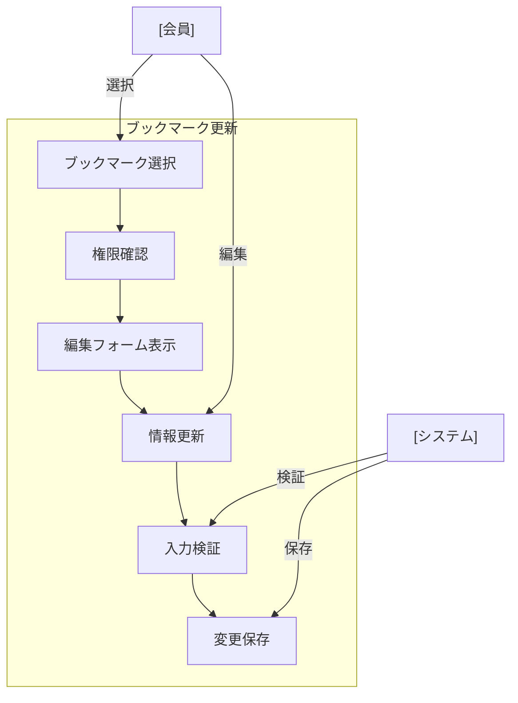

# ブックマーク更新

## ユースケース概要

既存のブックマーク情報を編集・更新する機能を提供します。

## アクター

- [会員] - ブックマーク情報を更新する一般ユーザー
- [システム] - ブックマーク情報を処理・保存するシステム

## 事前条件

- 会員としてログインしていること
- 更新対象のブックマークが存在すること
- ブックマークの編集権限があること（作成者または共同編集者）

## 想定シナリオ

[技術記事の整理と改善]

山田さん（35歳、テックリード）は、半年前に保存したマイクロサービスに関するブックマークのコレクションを見直していました。

時間の経過とともに、いくつかのリンクが古くなっていることに気づき、また、当時付けたタグや説明文も現在のプロジェクトの文脈に合わせて更新する必要性を感じました。

ブックマークの一括編集機能を使用して、URLの更新、タグの追加、説明文の改訂を行いました。また、フォルダ構成も見直し、より論理的な階層構造に再編成しました。

その結果、チームメンバーがより効率的に必要な情報にアクセスできるようになり、ナレッジの再利用性が向上しました。新メンバーの参加時のオンボーディング時間も20%短縮されました。

## 基本フロー

1. [会員]は更新対象のブックマークを選択
2. [システム]は編集フォームを表示
3. [会員]は以下の項目を必要に応じて更新：
   - URL
   - タイトル
   - 説明
   - カテゴリ
   - タグ
   - フォルダ位置
   - 共有設定
4. [システム]は入力内容を検証
5. [会員]は更新を確定
6. [システム]は変更を保存
7. [システム]は完了メッセージを表示

## 代替フロー

### URLが変更された場合

4a. [システム]は新URLの有効性を確認
4b. [システム]は重複チェックを実行
4c. [会員]は確認後に進める

### フォルダ移動の場合

3a. [システム]は新しい階層深度を確認
3b. [システム]は制限（最大深度5）を超える場合は警告
3c. [会員]は別のフォルダを選択

## 例外フロー

### 編集権限がない場合

1a. [システム]は権限エラーを表示
1b. [会員]は権限リクエストを送信可能

## 事後条件

- ブックマーク情報が更新されている
- 更新履歴が記録されている
- 関連するインデックスが更新されている

## 関連オブジェクト

- ブックマーク
  - URL（必須、有効なURL形式）
  - タイトル（必須、1-200文字）
  - 説明（任意、最大500文字）
  - カテゴリ（必須、1つ）
  - タグ（任意、最大10個、各30文字まで）
  - フォルダ（任意、最大深度5）
  - 共有設定
  - 作成日時
  - 更新日時
  - 更新履歴

## 補足情報

### バリデーションルール

1. URL
   - 有効なURL形式
   - アクセス可能であること
   - 重複チェック（警告）

2. テキスト入力
   - タイトル：1-200文字
   - 説明：最大500文字
   - タグ：30文字まで、最大10個

3. フォルダ
   - 最大階層深度：5
   - 循環参照のチェック