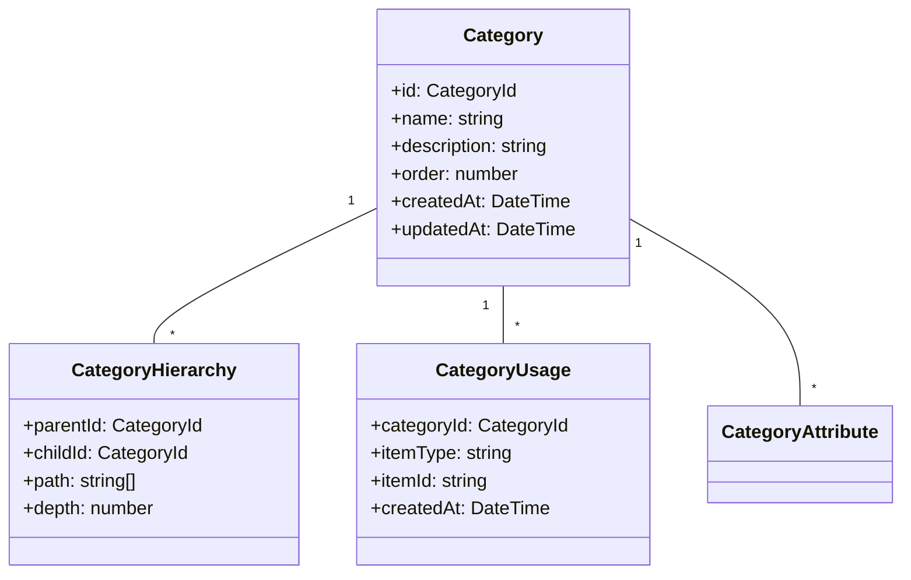
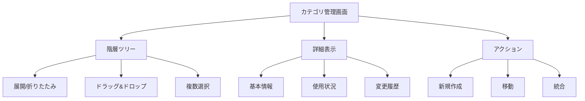

# カテゴリ管理ユースケース

## ユースケース概要

スタッフがシステム全体のカテゴリを管理・整理するためのユースケース。

## アクター

- [スタッフ]
- [システム]

## 事前条件

- スタッフ権限を持っていること
- カテゴリ管理権限があること

## 基本フロー

### シナリオ：カテゴリ体系の整理

シニアスタッフの鈴木隆は、コンテンツの増加に伴い、カテゴリ体系の見直しと再構築を行おうとしています。

1. [スタッフ]は(CategoryManagerConsole)にアクセス
2. [システム]は現在のカテゴリ階層を表示
3. [スタッフ]は新規カテゴリを作成
   - カテゴリ名
   - 説明
   - 親カテゴリ
   - 表示順序
4. [システム]は(ValidationService)で検証
5. [システム]は(CategoryManager)で保存
6. [システム]は(IndexService)でインデックス更新
7. [システム]は完了を通知

## 代替フロー

### A1. カテゴリの移動

3a. [スタッフ]は既存カテゴリを選択
4a. [スタッフ]は新しい親を指定
5a. [システム]は(HierarchyManager)で移動処理
6a. [システム]は関連アイテムを更新

### A2. カテゴリの統合

3b. [スタッフ]は複数カテゴリを選択
4b. [スタッフ]は統合先を指定
5b. [システム]は(CategoryMerger)で統合処理
6b. [システム]は関連付けを更新

## 例外フロー

### E1. 循環参照検出

4e. [システム]は循環参照を検出
5e. [システム]は(CycleDetector)でエラー処理
6e. 基本フローの3に戻る

### E2. 使用中カテゴリの削除

3e. [スタッフ]はカテゴリ削除を試行
4e. [システム]は使用中を検出
5e. [システム]は代替カテゴリの指定を要求
6e. [スタッフ]は代替を指定または中止

## 事後条件

- カテゴリが更新されていること
- 階層構造が維持されていること
- 関連アイテムが更新されていること

## 関連オブジェクト

- (Category): カテゴリ情報
- (CategoryHierarchy): 階層構造
- (CategoryUsage): 使用状況
- (CategoryManager): カテゴリ管理
- (HierarchyManager): 階層管理
- (IndexService): インデックス管理

## 補足資料

### データモデル



### バリデーションルール

1. カテゴリ名
   - 長さ：1-100文字
   - 重複不可
   - 予約語禁止

2. 階層制限
   - 最大深さ：5階層
   - 子カテゴリ数：100以下
   - 循環参照禁止

### イベント定義

```typescript
type CategoryEvent = {
    type: "CREATE" | "UPDATE" | "MOVE" | "MERGE" | "DELETE";
    categoryId: CategoryId;
    timestamp: DateTime;
    data: {
        name?: string;
        description?: string;
        parentId?: CategoryId;
        order?: number;
    };
    metadata: {
        actor: string;
        reason?: string;
        affected?: CategoryId[];
    };
};
```

### 階層管理ロジック

```typescript
type HierarchyOperation = {
    // 移動操作
    move: {
        targetId: CategoryId;
        newParentId: CategoryId;
        updateStrategy: "cascade" | "reindex";
    };
    
    // パス更新
    updatePath: {
        categories: CategoryId[];
        operation: "rebuild" | "update";
    };
    
    // 整合性チェック
    validate: {
        checkCycles: boolean;
        checkDepth: boolean;
        checkConstraints: boolean;
    };
};
```

### UI レイアウト



### 監視メトリクス

```mermaid
graph TD
    Metrics["メトリクス"]
    Structure["構造分析"]
    Usage["使用分析"]
    
    Metrics --> Structure
    Metrics --> Usage
    Metrics --> Health["健全性"]
    
    Structure --> Depth["階層深度"]
    Structure --> Size["サイズ"]
    Structure --> Balance["バランス"]
    
    Usage --> Items["アイテム数"]
    Usage --> Access["アクセス数"]
    Usage --> Empty["未使用"]
    
    Health --> Cycles["循環参照"]
    Health --> Orphans["孤立"]
    Health --> Constraints["制約違反"]