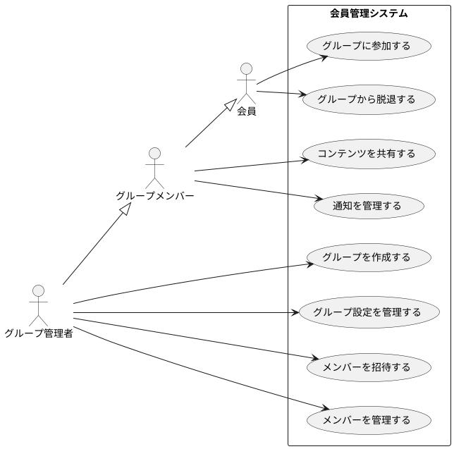

# 会員管理システム ユースケース仕様書

## システム概要図

## ユースケース詳細

### UC-1: グループを作成する

**概要**: 会員が新しいグループを作成する

**アクター**: 会員（グループ管理者となる）

**事前条件**:

- アクターがシステムにログインしている
- アクターが有効な会員である

**基本フロー**:

1. アクターが「グループ作成」を選択する
2. システムが作成フォームを表示する
3. アクターが以下の情報を入力する：
   - グループ名
   - 説明
   - 公開設定
   - アイコン（オプション）
4. システムが入力内容を検証する
5. システムがグループを作成する
6. システムがアクターをグループ管理者として設定する
7. システムが完了を通知する

**代替フロー**:

- 4a: 入力内容が無効な場合
  1. システムがエラーを表示する
  2. 基本フロー3に戻る
- 5a: グループ作成に失敗した場合
  1. システムがエラーを表示する
  2. 基本フロー3に戻る

**事後条件**:

- 新しいグループが作成される
- アクターがグループ管理者となる

### UC-2: グループ設定を管理する

**概要**: グループ管理者がグループの設定を管理する

**アクター**: グループ管理者

**事前条件**:

- アクターがグループ管理者である
- 対象のグループが存在する

**基本フロー**:

1. アクターがグループ設定画面を開く
2. システムが現在の設定を表示する
3. アクターが以下の設定を変更できる：
   - グループ名
   - 説明
   - 公開設定
   - 参加承認方法
   - コンテンツ共有ルール
4. システムが変更を保存する
5. システムが完了を通知する

**代替フロー**:

- 4a: 設定の保存に失敗した場合
  1. システムがエラーを表示する
  2. 基本フロー3に戻る

**事後条件**:

- グループ設定が更新される
- 関連するメンバーに通知が送信される

### UC-3: メンバーを招待する

**概要**: グループ管理者が新しいメンバーを招待する

**アクター**: グループ管理者

**事前条件**:

- アクターがグループ管理者である
- 招待するユーザーが有効な会員である

**基本フロー**:

1. アクターがメンバー招待機能を選択する
2. システムが招待フォームを表示する
3. アクターが以下の情報を入力する：
   - 招待する会員のID/メールアドレス
   - 付与する権限レベル
4. システムが招待を送信する
5. システムが完了を通知する

**代替フロー**:

- 3a: 指定したユーザーが存在しない場合
  1. システムがエラーを表示する
  2. 基本フロー3に戻る
- 4a: 招待の送信に失敗した場合
  1. システムがエラーを表示する
  2. 基本フロー3に戻る

**事後条件**:

- 招待が送信される
- 招待記録が保存される

### UC-4: グループに参加する

**概要**: 会員がグループに参加する

**アクター**: 会員

**事前条件**:

- アクターが有効な会員である
- 対象のグループが存在する

**基本フロー**:

1. アクターがグループ参加を選択する
2. システムが参加方法を表示する：
   - 招待からの参加
   - 公開グループへの参加申請
3. アクターが参加方法を選択する
4. システムが参加処理を実行する
5. システムが完了を通知する

**代替フロー**:

- 4a: 参加に承認が必要な場合
  1. システムが管理者に承認要求を送信する
  2. 管理者の承認待ちとなる
- 4b: 参加条件を満たさない場合
  1. システムがエラーを表示する
  2. プロセスを終了する

**事後条件**:

- グループメンバーとして登録される
- 参加履歴が記録される

### UC-5: コンテンツを共有する

**概要**: グループメンバーがコンテンツを共有する

**アクター**: グループメンバー

**事前条件**:

- アクターがグループのメンバーである
- アクターが共有権限を持っている

**基本フロー**:

1. アクターが共有機能を選択する
2. システムが共有フォームを表示する
3. アクターが以下の情報を入力する：
   - 共有するコンテンツ
   - 公開範囲設定
   - 説明（オプション）
4. システムがコンテンツを検証する
5. システムがコンテンツを共有する
6. システムが完了を通知する

**代替フロー**:

- 4a: コンテンツが無効な場合
  1. システムがエラーを表示する
  2. 基本フロー3に戻る
- 5a: 共有に失敗した場合
  1. システムがエラーを表示する
  2. 基本フロー3に戻る

**事後条件**:

- コンテンツが共有される
- 関連するメンバーに通知が送信される
- 共有履歴が記録される

### UC-6: 通知を管理する

**概要**: メンバーが通知設定を管理する

**アクター**: グループメンバー

**事前条件**:

- アクターがグループのメンバーである

**基本フロー**:

1. アクターが通知設定を選択する
2. システムが現在の設定を表示する
3. アクターが以下の設定を変更できる：
   - 通知の種類（コンテンツ更新、メンバー変更など）
   - 通知方法（メール、システム内通知）
   - 通知頻度
4. システムが設定を保存する
5. システムが完了を通知する

**代替フロー**:

- 4a: 設定の保存に失敗した場合
  1. システムがエラーを表示する
  2. 基本フロー3に戻る

**事後条件**:

- 通知設定が更新される
- 新しい設定が即時反映される

## 注記

このドキュメントは下書きであり、以下の点について今後の更新が予定されています：

1. セキュリティ要件の詳細化
2. エラー処理の具体化
3. パフォーマンス要件の追加
4. データ保持ポリシーの明確化
5. 監査ログ要件の追加

Version: 0.1.0 (Draft)
Last Updated: 2025-03-03
