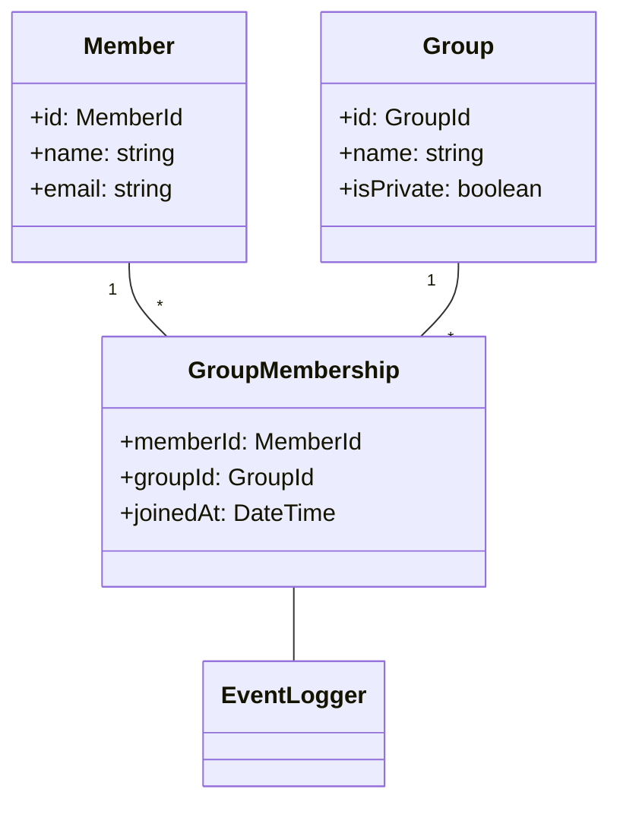

# グループ所属管理ユースケース

## ユースケース概要

会員がグループに参加し、複数のグループで情報共有を行うためのユースケース。

## アクター

- [会員]
- [システム]

## 事前条件

- アカウントが有効であること
- グループが存在すること

## 基本フロー

### シナリオ：新規グループ参加

山田太郎は、業界の最新情報を共有する「テック情報交換会」というグループに参加しようとしています。

1. [会員]は(GroupSearchForm)からグループを検索
2. [システム]は検索結果を(GroupList)として表示
3. [会員]は参加したいグループを選択
4. [システム]は(GroupJoinRequest)を生成
5. [会員]は参加リクエストを送信
6. [システム]は(MembershipManager)で処理を実行
7. [システム]は(NotificationService)で完了通知を送信

## 代替フロー

### A1. 非公開グループの場合

4a. [システム]は承認要求を管理者に送信
5a. グループ管理者の承認を待機
6a. 承認後に参加処理を実行

### A2. 招待リンクからの参加

1a. [会員]は招待リンクをクリック
2a. [システム]は(GroupJoinRequest)を自動生成
3a. 基本フローの6に合流

## 例外フロー

### E1. 参加上限に達している場合

6e. [システム]は(ErrorHandler)でエラーを処理
7e. [システム]は[会員]にエラーメッセージを表示

### E2. 既に所属している場合

4e. [システム]は重複チェックを実行
5e. [システム]は[会員]に通知

## 事後条件

- [会員]がグループに所属していること
- グループのメンバーリストが更新されていること
- 参加履歴が記録されていること

## 関連オブジェクト

- (Member): 会員情報
- (Group): グループ情報
- (GroupMembership): グループ所属関係
- (MembershipManager): 所属管理
- (NotificationService): 通知サービス
- (EventLogger): イベント記録

## 補足資料

### データモデル



### バリデーションルール

1. グループ参加数の制限
   - 一人の会員が所属できるグループ数の上限：100
   - 一つのグループの所属メンバー数上限：10000

2. 参加リクエストの制限
   - 同一グループへの pending 状態のリクエスト：1
   - 24時間あたりの参加リクエスト数：20

### イベント定義

```typescript
type MembershipEvent = {
    type: "JOIN" | "LEAVE" | "SUSPEND";
    memberId: MemberId;
    groupId: GroupId;
    timestamp: DateTime;
    metadata: {
        requestId?: string;
        reason?: string;
    };
};