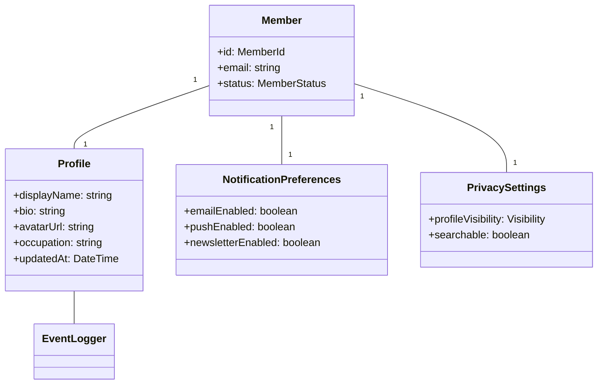

# 会員情報管理ユースケース

## ユースケース概要

会員が自身のプロフィール情報を管理し、各種設定を行うためのユースケース。

## アクター

- [会員]
- [システム]

## 事前条件

- アカウントが有効であること
- ログイン済みであること

## 基本フロー

### シナリオ：プロフィール更新

フリーランスの山田花子は、最近の活動内容に合わせてプロフィール情報を更新しようとしています。

1. [会員]は(ProfileView)から設定画面を開く
2. [システム]は現在の設定を(ProfileForm)に表示
3. [会員]はプロフィール情報を編集
   - 表示名
   - 自己紹介
   - プロフィール画像
   - 職業情報
4. [システム]は(ValidationService)で入力を検証
5. [システム]は(MemberProfileManager)で更新を実行
6. [システム]は(EventLogger)で変更を記録
7. [システム]は更新完了を通知

## 代替フロー

### A1. 通知設定の変更

3a. [会員]は通知設定を変更
   - メール通知
   - プッシュ通知
   - ニュースレター
4a. [システム]は(NotificationPreferences)を更新

### A2. プライバシー設定の変更

3b. [会員]はプライバシー設定を変更
   - プロフィール公開範囲
   - 検索可能性
4b. [システム]は(PrivacySettings)を更新

## 例外フロー

### E1. バリデーションエラー

4e. [システム]は入力エラーを検出
5e. [システム]は(ValidationError)を表示
6e. 基本フローの3に戻る

### E2. 画像アップロードエラー

3e. [会員]が大きすぎる画像をアップロード
4e. [システム]は(FileError)を表示
5e. 基本フローの3に戻る

## 事後条件

- プロフィール情報が更新されていること
- 変更履歴が記録されていること
- 関連する設定が反映されていること

## 関連オブジェクト

- (Member): 会員情報
- (Profile): プロフィール情報
- (NotificationPreferences): 通知設定
- (PrivacySettings): プライバシー設定
- (ValidationService): 入力検証
- (FileService): ファイル管理
- (EventLogger): 変更履歴

## 補足資料

### データモデル



### バリデーションルール

1. プロフィール情報
   - 表示名：1-50文字
   - 自己紹介：0-1000文字
   - 画像：5MB以下、jpg/png/gif

2. 更新制限
   - 表示名の変更：30日に1回まで
   - 画像のアップロード：1日10回まで

### イベント定義

```typescript
type ProfileEvent = {
    type: "UPDATE_PROFILE" | "UPDATE_SETTINGS";
    memberId: MemberId;
    timestamp: DateTime;
    changes: {
        field: string;
        oldValue: unknown;
        newValue: unknown;
    }[];
    metadata: {
        reason?: string;
        source?: string;
    };
};
```

### UI モックアップ

```mermaid
graph TD
    Tab1["プロフィール編集"]
    Tab2["通知設定"]
    Tab3["プライバシー"]
    
    Tab1 --> Form["編集フォーム"]
    Form --> Save["保存"]
    Form --> Cancel["キャンセル"]
    
    Tab2 --> Notifications["通知オプション"]
    Tab3 --> Privacy["公開設定"]