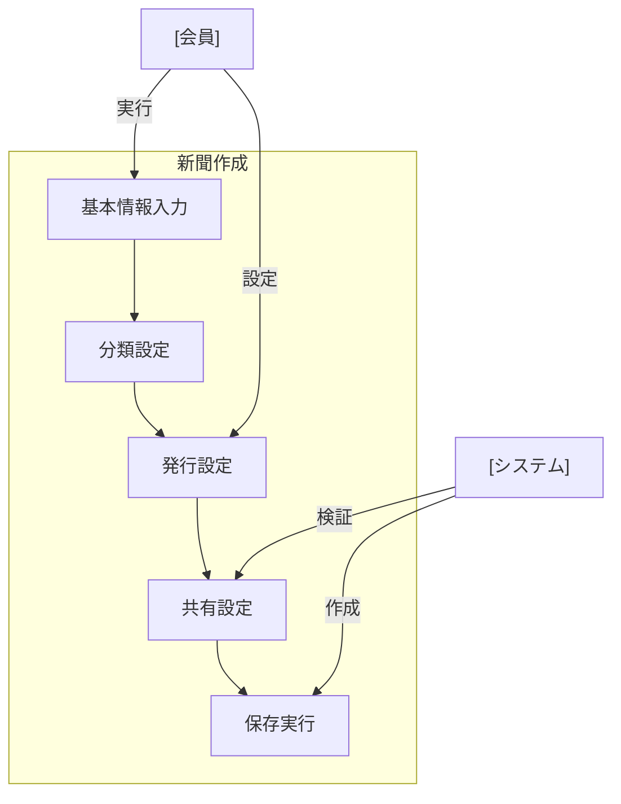

# 新聞作成

## ユースケース概要

関連する記事をまとめるための新聞を作成し、基本設定や分類を行う機能を提供します。定期発行の設定や共有範囲の指定なども含みます。

## アクター

- [会員] - 新聞を作成する一般ユーザー
- [システム] - 新聞情報を処理・保存するシステム

## 事前条件

- 会員としてログインしていること
- 新聞作成の権限があること

## 想定シナリオ

[技術情報の定期共有]

木村さん（33歳、シニアエンジニア）は、フロントエンド技術の最新動向をチーム内で共有するため、週刊の技術新聞を作成することにしました。

新聞作成機能を使用して「Frontend Weekly」という新聞を作成し、「技術情報」カテゴリを設定。ReactやTypeScriptなどの主要なタグを登録し、週次の自動発行スケジュールを設定しました。

共有設定では、開発チームのメンバーを編集者として追加し、その他のチームメンバーには閲覧権限を付与。コメント機能も有効化して、記事に対する議論を促進できるようにしました。

この新聞の運用により、チーム内の技術情報の共有が体系化され、新しい技術のキャッチアップ時間が週あたり平均2時間短縮されました。

## 基本フロー

1. [会員]は新聞作成機能を選択
2. [システム]は作成フォームを表示
3. [会員]は以下の情報を入力：
   - タイトル
   - 説明
   - カテゴリ（1つ）
   - タグ（複数可）
   - 発行頻度設定
   - 共有設定
4. [システム]は入力内容を検証
5. [会員]は保存を実行
6. [システム]は新聞を作成
7. [システム]は共有設定を適用
8. [システム]は完了メッセージを表示

## 代替フロー

### テンプレートの使用

3a. [会員]は既存テンプレートを選択
3b. [システム]はテンプレート内容を読み込み
3c. [会員]は必要に応じて内容を編集

### 定期発行の設定

3a. [会員]は定期発行を選択
3b. [システム]は発行設定フォームを表示：
    - 発行頻度
    - 発行日時
    - 自動集約ルール

## 例外フロー

### 同名の新聞が存在する場合

4a. [システム]は重複を警告
4b. [会員]はタイトルを変更

## 事後条件

- 新聞が作成されている
- 共有設定が適用されている
- 定期発行がスケジュールされている（該当する場合）

## 関連オブジェクト

- 新聞
  - タイトル（必須、1-200文字）
  - 説明（任意、最大500文字）
  - カテゴリ（必須、1つ）
  - タグ（任意、最大10個）
  - 発行設定
  - 共有設定
  - 作成日時
  - 更新日時

## 補足情報

### 新聞の特徴

1. 発行形式
   - 定期発行
   - 単発発行
   - イベント駆動発行

2. 共有設定
   - 編集者設定
   - 閲覧者設定
   - コメント権限
   - 再共有権限

3. 自動化機能
   - 記事の自動集約
   - タグベースの振り分け
   - 関連記事の推薦
   - 発行通知