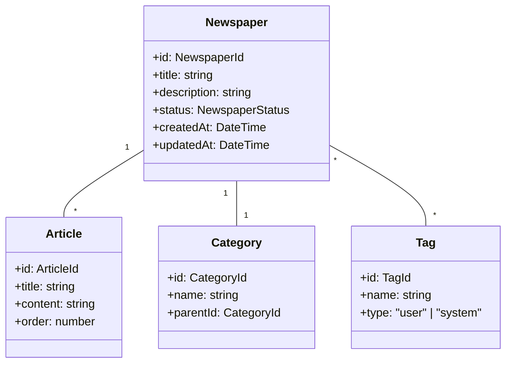

# 新聞管理ユースケース

## ユースケース概要

会員が新聞を作成・管理し、記事を整理するためのユースケース。

## アクター

- [会員]
- [システム]

## 事前条件

- アカウントが有効であること
- ログイン済みであること

## 基本フロー

### シナリオ：テーマ別新聞の作成

編集者の佐藤雅子は、テクノロジー関連の記事を集約した新しい新聞を作成しようとしています。

1. [会員]は(NewspaperForm)から新聞を作成
2. [システム]は入力フォームを表示
3. [会員]は新聞情報を入力
   - タイトル
   - 説明
   - カテゴリ選択
   - タグ設定
4. [システム]は(ValidationService)で入力を検証
5. [システム]は(NewspaperManager)で保存を実行
6. [システム]は(IndexingService)でインデックス更新
7. [システム]は完了を通知

## 代替フロー

### A1. テンプレートからの作成

1a. [会員]はテンプレートを選択
2a. [システム]は(TemplateManager)でテンプレート読込
3a. [会員]はテンプレート内容を編集
4a. 基本フローの4に合流

### A2. 既存新聞のコピー

1b. [会員]は既存新聞を選択
2b. [システム]は(NewspaperCopier)でコピー作成
3b. [会員]はコピー内容を編集
4b. 基本フローの4に合流

## 例外フロー

### E1. バリデーションエラー

4e. [システム]は入力エラーを検出
5e. [システム]はエラーメッセージを表示
6e. 基本フローの3に戻る

### E2. 重複タイトル

5e. [システム]は重複を検出
6e. [システム]は(DuplicateHandler)でエラー処理
7e. 基本フローの3に戻る

## 事後条件

- 新聞が作成されていること
- カテゴリとタグが設定されていること
- インデックスが更新されていること

## 関連オブジェクト

- (Newspaper): 新聞情報
- (Category): カテゴリ情報
- (Tag): タグ情報
- (NewspaperManager): 新聞管理
- (TemplateManager): テンプレート管理
- (IndexingService): インデックス管理

## 補足資料

### データモデル



### バリデーションルール

1. 新聞
   - タイトル：1-100文字
   - 説明：0-1000文字
   - 記事数：最大1000件

2. 制限
   - 会員あたりの新聞数：100
   - 1新聞あたりのタグ数：20

### イベント定義

```typescript
type NewspaperEvent = {
    type: "CREATE" | "UPDATE" | "DELETE" | "ARCHIVE";
    newspaperId: NewspaperId;
    timestamp: DateTime;
    data: {
        title?: string;
        description?: string;
        categoryId?: CategoryId;
        tags?: TagId[];
    };
    metadata: {
        status: NewspaperStatus;
        author: MemberId;
        template?: TemplateId;
    };
};
```

### テンプレート構造

```typescript
type NewspaperTemplate = {
    id: TemplateId;
    name: string;
    description: string;
    structure: {
        title: string;
        sections: Array<{
            name: string;
            description: string;
            order: number;
        }>;
        defaultCategory?: CategoryId;
        suggestedTags: TagId[];
    };
    metadata: {
        author: MemberId;
        usage: number;
        rating: number;
    };
};
```

### UI レイアウト

```mermaid
graph TD
    Main["メインエリア"]
    Sidebar["サイドバー"]
    Editor["エディター"]
    
    Main --> List["新聞一覧"]
    Main --> Editor
    
    Sidebar --> Templates["テンプレート"]
    Sidebar --> Categories["カテゴリ"]
    Sidebar --> Tags["タグ"]
    
    Editor --> Basic["基本情報"]
    Editor --> Structure["構成"]
    Editor --> Articles["記事一覧"]
    
    Basic --> Title["タイトル"]
    Basic --> Desc["説明"]
    Basic --> Meta["メタデータ"]
    
    Structure --> Sections["セクション"]
    Structure --> Order["順序"]
    
    Articles --> Preview["プレビュー"]
    Articles --> Manage["記事管理"]