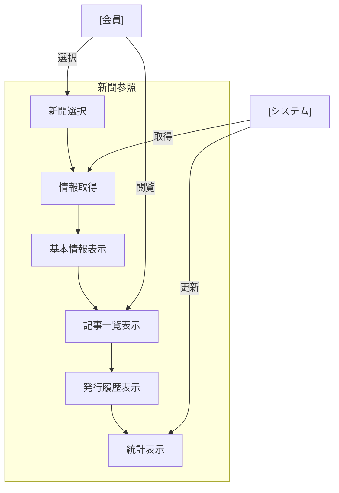

# 新聞参照 (np-r-001)

## ユースケース概要

作成された新聞の詳細情報を閲覧し、含まれる記事の一覧や発行履歴を確認する機能を提供します。新聞の基本情報、統計情報、関連する新聞の表示なども含みます。

## アクター

- [会員] - 新聞を閲覧する一般ユーザー
- [システム] - 新聞情報を提供するシステム

## 事前条件

- 会員としてログインしていること
- 参照対象の新聞が存在すること
- 新聞への閲覧権限があること

## 想定シナリオ

[技術情報のキャッチアップ]

中村さん（27歳、エンジニア）は、チームで共有されている「Frontend Weekly」という技術新聞を確認し、最新のフロントエンド開発動向をキャッチアップすることにしました。

新聞の詳細画面では、今週号に含まれる記事の一覧が重要度順に表示され、各記事に付けられたハイライトやメモも確認できました。また、過去の発行履歴から、技術トピックの変遷も把握できました。

関連する新聞のレコメンド機能により、バックエンド技術やインフラ関連の新聞も発見。チーム全体の技術スタックを広く理解することができました。

このような体系的な情報収集により、従来は半日かかっていた技術動向の把握が1時間程度で完了するようになりました。

## 基本フロー

1. [会員]は新聞一覧から新聞を選択
2. [システム]は新聞の詳細情報を取得
3. [システム]は以下の情報を表示：
   - 新聞の基本情報
   - 最新号の記事一覧
   - 発行履歴
   - 統計情報
   - 関連新聞
4. [会員]は記事一覧を確認
5. [会員]は発行履歴を閲覧可能
6. [会員]は各記事の詳細を確認可能
7. [システム]は閲覧状況を更新

## 代替フロー

### 過去の発行号の閲覧

5a. [会員]は過去の発行号を選択
5b. [システム]は選択された号の詳細を表示
5c. [会員]は号内の記事を閲覧可能

### 統計情報の詳細表示

4a. [会員]は統計情報の詳細を要求
4b. [システム]は詳細な分析データを表示：
    - 記事数推移
    - アクセス統計
    - タグ分布
    - カテゴリ分布

## 例外フロー

### 新聞が削除されている場合

2a. [システム]は削除された旨を表示
2b. [会員]は新聞一覧に戻る

## 事後条件

- 新聞の情報が表示されている
- 閲覧履歴が更新されている
- 関連新聞が表示されている

## 関連オブジェクト

- 新聞
  - タイトル
  - 説明
  - カテゴリ
  - タグ
  - 発行設定
  - 共有設定
  - 統計情報

- 発行情報
  - 発行号
  - 発行日時
  - 記事一覧
  - アクセス数

## 補足情報

### 表示機能の特徴

1. 記事表示
   - 重要度順表示
   - カテゴリ別表示
   - タグ別表示
   - タイムライン表示

2. 発行履歴
   - 号別一覧
   - カレンダー表示
   - 記事数推移
   - トピック推移

3. 統計情報
   - アクセス分析
   - 人気記事
   - タグ分析
   - 共有状況

4. インタラクション
   - クイックプレビュー
   - 記事間ナビゲーション
   - ブックマーク機能
   - 共有機能