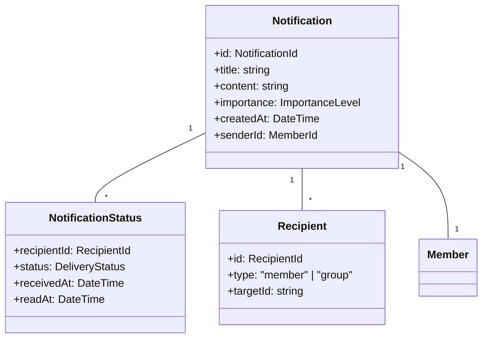
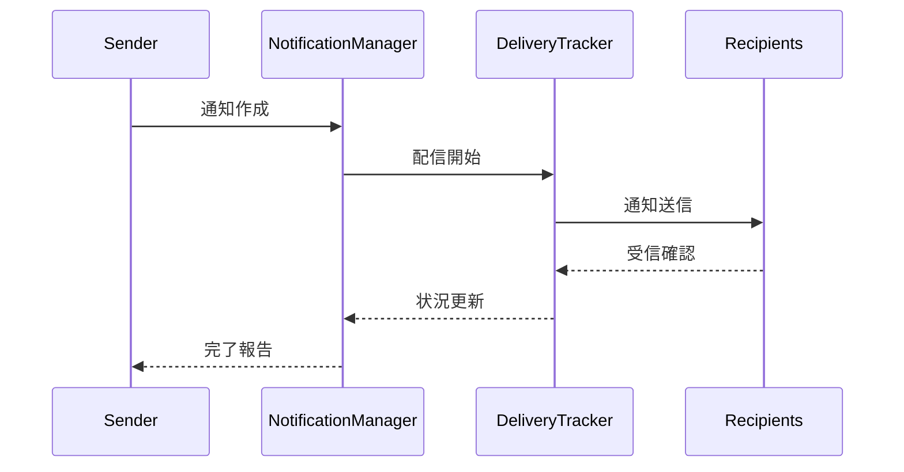

# 通知管理ユースケース

## ユースケース概要

会員が他の会員やグループに通知を送信し、その状況を管理するためのユースケース。

## アクター

- [会員]
- [システム]

## 事前条件

- アカウントが有効であること
- ログイン済みであること

## 基本フロー

### シナリオ：チーム通知の送信

チームリーダーの高橋健一は、重要な技術情報を開発チームメンバー全員に共有しようとしています。

1. [会員]は(NotificationForm)から通知を作成
2. [システム]は入力フォームを表示
3. [会員]は通知情報を入力
   - タイトル
   - 本文
   - 宛先（会員/グループ）
   - 重要度
   - 添付情報
4. [システム]は(ValidationService)で入力を検証
5. [システム]は(NotificationManager)で送信を実行
6. [システム]は(DeliveryTracker)で配信を追跡
7. [システム]は完了を通知

## 代替フロー

### A1. グループ一括通知

3a. [会員]はグループを選択
4a. [システム]は(GroupResolver)でメンバーを解決
5a. 基本フローの4に合流

### A2. 再通知

1a. [会員]は既存の通知を選択
2a. [会員]は再通知対象を選択
3a. [システム]は(RenotificationService)で処理
4a. 基本フローの6に合流

## 例外フロー

### E1. バリデーションエラー

4e. [システム]は入力エラーを検出
5e. [システム]はエラーメッセージを表示
6e. 基本フローの3に戻る

### E2. 送信制限超過

5e. [システム]は制限超過を検出
6e. [システム]は(RateLimiter)でエラー処理
7e. [システム]は警告を表示

## 事後条件

- 通知が送信されていること
- 配信状況が追跡可能になっていること
- 受信者に通知が届いていること

## 関連オブジェクト

- (Notification): 通知情報
- (NotificationStatus): 配信状況
- (Recipient): 受信者情報
- (NotificationManager): 通知管理
- (DeliveryTracker): 配信追跡
- (RateLimiter): 制限管理

## 補足資料

### データモデル



### バリデーションルール

1. 通知
   - タイトル：1-100文字
   - 本文：1-2000文字
   - 添付：最大5個、各5MB以下

2. 制限
   - 1時間あたりの送信数：100
   - 1通知あたりの受信者数：1000
   - 再通知の間隔：1時間

### イベント定義

```typescript
type NotificationEvent = {
    type: "SEND" | "RECEIVE" | "READ" | "RENOTIFY";
    notificationId: NotificationId;
    timestamp: DateTime;
    data: {
        recipientId?: RecipientId;
        status?: DeliveryStatus;
        metadata?: Record<string, unknown>;
    };
    tracking: {
        deviceType: string;
        ipAddress: string;
        userAgent: string;
    };
};
```

### 配信フロー



### UI レイアウト

```mermaid
graph TD
    Main["メインエリア"]
    Sidebar["サイドバー"]
    Composer["作成画面"]
    
    Main --> Inbox["受信箱"]
    Main --> Sent["送信済み"]
    Main --> Composer
    
    Sidebar --> Status["配信状況"]
    Sidebar --> Groups["グループ"]
    Sidebar --> Stats["統計"]
    
    Composer --> Recipients["宛先選択"]
    Composer --> Content["内容作成"]
    Composer --> Options["オプション"]
    
    Status --> Pending["配信中"]
    Status --> Delivered["配信済"]
    Status --> Failed["失敗"]