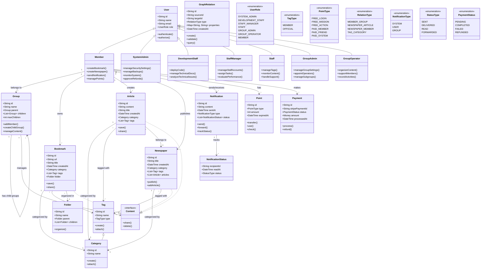

# システムクラス図

## 図の説明

1. ユーザー権限システム
   - Userを基底クラスとし、各役割を継承で表現
   - UserRoleで権限レベルを管理
   - 各役割に応じた操作を定義

2. グループ管理システム
   - 階層構造（最大100子グループ）
   - グループ管理者とグループ運営者の権限分離
   - コンテンツとメンバーの管理機能

3. コンテンツ管理システム
   - Content interfaceによる共通機能の定義
   - カテゴリとタグによる分類
   - フォルダによる階層管理（ブックマーク）

4. 通知システム
   - 通知の種類と状態管理
   - 転送機能と状況追跡
   - NotificationStatusによる詳細な状態管理

5. ポイントと決済システム
   - 無償/有償ポイントの種類を詳細化
   - Stripe連携のための決済クラス
   - 決済状態の管理

6. 関係管理システム
   - GraphRelationによるグラフDB対応
   - 柔軟なプロパティ管理
   - 関係性のクエリ機能

7. セキュリティと監査
   - ユーザー認証と承認の分離
   - 操作履歴の追跡
   - システム全体のモニタリング