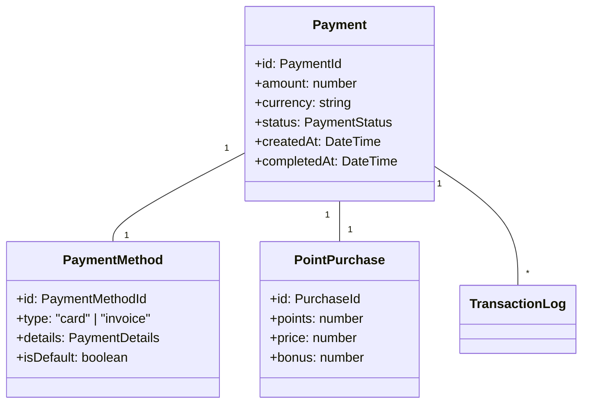
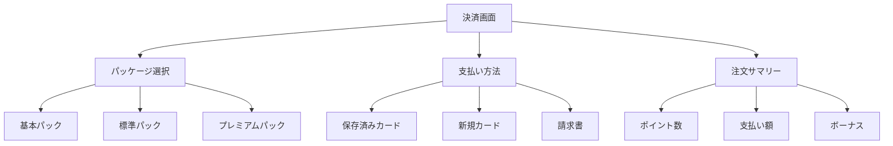

# 決済管理ユースケース

## ユースケース概要

会員がポイントを購入し、決済処理と履歴を管理するためのユースケース。

## アクター

- [会員]
- [システム]
- [Stripe]
- [システム管理者]

## 事前条件

- アカウントが有効であること
- ログイン済みであること
- Stripeが利用可能であること

## 基本フロー

### シナリオ：ポイント購入決済

中村良介は、システムでポイントを購入し、クレジットカードで支払いを行おうとしています。

1. [会員]は(PurchaseForm)から購入を開始
2. [システム]は購入オプションを表示
3. [会員]は購入内容を選択
   - ポイント数
   - 支払い方法
4. [システム]は(ValidationService)で検証
5. [Stripe]で決済処理を実行
6. [システム]は(PaymentManager)で処理を記録
7. [システム]は(PointManager)でポイント付与
8. [システム]は完了を通知

## 代替フロー

### A1. 保存済みカードでの支払い

3a. [会員]は保存済みカードを選択
4a. [システム]は(SavedCardValidator)で検証
5a. 基本フローの5に合流

### A2. 請求書での支払い

3b. [会員]は請求書発行を選択
4b. [システム]は(InvoiceManager)で請求書発行
5b. [会員]は別途支払い手続き
6b. [システム]は入金確認後に処理完了

## 例外フロー

### E1. 決済エラー

5e. [Stripe]でエラー発生
6e. [システム]は(ErrorHandler)で処理
7e. [システム]は[会員]に再試行を促す

### E2. 制限超過

4e. [システム]は購入制限超過を検出
5e. [システム]は(LimitManager)でエラー処理
6e. 基本フローを終了

## 事後条件

- 決済が完了していること
- ポイントが付与されていること
- 履歴が記録されていること

## 関連オブジェクト

- (Payment): 決済情報
- (PaymentMethod): 支払い方法
- (PaymentManager): 決済管理
- (PointManager): ポイント管理
- (Invoice): 請求書
- (TransactionLog): 取引履歴

## 補足資料

### データモデル



### バリデーションルール

1. 購入制限
   - 1回あたりの上限：100,000円
   - 1月あたりの上限：500,000円
   - 最小購入額：1,000円

2. 支払い方法
   - クレジットカード
   - 請求書払い（法人のみ）

### イベント定義

```typescript
type PaymentEvent = {
    type: "INITIALIZE" | "PROCESS" | "COMPLETE" | "FAIL" | "REFUND";
    paymentId: PaymentId;
    timestamp: DateTime;
    data: {
        amount: number;
        currency: string;
        method: PaymentMethodType;
        status: PaymentStatus;
    };
    metadata: {
        stripeId?: string;
        errorCode?: string;
        refundReason?: string;
    };
};
```

### Stripe連携

```typescript
type StripeIntegration = {
    // 支払い処理
    createPayment: {
        amount: number;
        currency: string;
        customerId: string;
        paymentMethod: string;
    };
    
    // 顧客管理
    customer: {
        id: string;
        email: string;
        paymentMethods: string[];
        defaultPaymentMethod?: string;
    };
    
    // エラーハンドリング
    error: {
        code: string;
        message: string;
        declineCode?: string;
        retry?: boolean;
    };
};
```

### UI レイアウト



### 管理機能

```mermaid
graph TD
    Admin["管理画面"]
    Reports["レポート"]
    Settings["設定"]
    
    Admin --> Trans["取引一覧"]
    Admin --> Reports
    Admin --> Settings
    
    Reports --> Daily["日次集計"]
    Reports --> Monthly["月次集計"]
    Reports --> Custom["カスタム"]
    
    Settings --> Limits["制限設定"]
    Settings --> Rates["レート設定"]
    Settings --> Methods["支払い方法"]