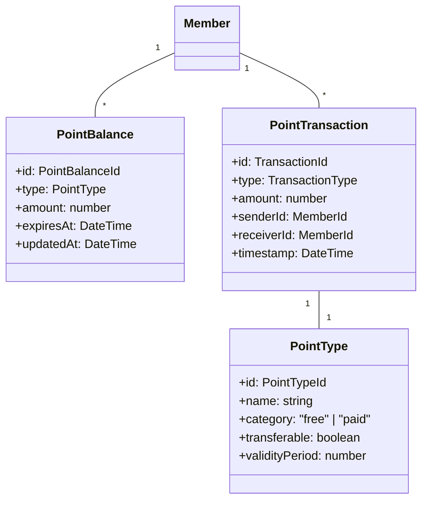

# ポイント管理ユースケース

## ユースケース概要

会員がポイントを獲得、使用、管理、譲渡するためのユースケース。

## アクター

- [会員]
- [システム]
- [決済システム]

## 事前条件

- アカウントが有効であること
- ログイン済みであること

## 基本フロー

### シナリオ：ポイント管理と利用

木村直子は、貯まったポイントの確認と、友人への譲渡を行おうとしています。

1. [会員]は(PointDashboard)でポイント状況を確認
2. [システム]は以下を表示
   - 無償ポイント残高
   - 有償ポイント残高
   - ポイント有効期限
   - 利用履歴
3. [会員]は(TransferForm)で譲渡操作を選択
4. [システム]は(ValidationService)で譲渡可能性を検証
5. [会員]は譲渡情報を入力
   - 譲渡先会員
   - ポイント数
   - メッセージ
6. [システム]は(PointManager)で譲渡を実行
7. [システム]は(TransactionLogger)で記録
8. [システム]は完了を通知

## 代替フロー

### A1. ポイント購入

1a. [会員]は(PurchaseForm)で購入を選択
2a. [システム]は購入オプションを表示
3a. [会員]は購入内容を選択
4a. [決済システム]で支払い処理
5a. [システム]は(PointManager)でポイント付与

### A2. ミッション達成

1b. [会員]がミッションを完了
2b. [システム]は(MissionManager)で判定
3b. [システム]は(PointManager)で報酬付与
4b. [システム]は達成通知を送信

## 例外フロー

### E1. 残高不足

4e. [システム]は残高不足を検出
5e. [システム]はエラーメッセージを表示
6e. 基本フローを終了

### E2. 譲渡制限

4e. [システム]は制限超過を検出
5e. [システム]は(RuleValidator)でエラー処理
6e. 基本フローを終了

## 事後条件

- ポイント残高が更新されていること
- 取引履歴が記録されていること
- 関係者に通知が送信されていること

## 関連オブジェクト

- (Point): ポイント情報
- (PointTransaction): 取引情報
- (PointManager): ポイント管理
- (MissionManager): ミッション管理
- (RuleValidator): ルール検証
- (TransactionLogger): 履歴記録

## 補足資料

### データモデル



### バリデーションルール

1. 譲渡制限
   - 1回あたりの上限：10,000ポイント
   - 1日あたりの上限：50,000ポイント
   - 最小単位：100ポイント

2. 有効期限
   - 無償ポイント：獲得から6ヶ月
   - 有償ポイント：獲得から2年
   - ボーナスポイント：イベントごとに設定

### イベント定義

```typescript
type PointEvent = {
    type: "EARN" | "SPEND" | "TRANSFER" | "EXPIRE";
    pointId: PointId;
    timestamp: DateTime;
    data: {
        amount: number;
        pointType: PointType;
        senderId?: MemberId;
        receiverId?: MemberId;
    };
    metadata: {
        source: TransactionSource;
        reason?: string;
        expiration?: DateTime;
    };
};
```

### ポイント計算ロジック

```typescript
type PointCalculation = {
    // 残高計算
    balance: {
        free: number;
        paid: number;
        bonus: number;
        total: number;
    };
    
    // 有効期限管理
    expiration: {
        nearest: DateTime;
        upcoming: Array<{
            amount: number;
            expiresAt: DateTime;
        }>;
    };
    
    // 利用可能額計算
    available: {
        transferable: number;
        spendable: number;
        restricted: number;
    };
};
```

### UI レイアウト

```mermaid
graph TD
    Main["メインダッシュボード"]
    Actions["アクション"]
    History["履歴"]
    
    Main --> Balance["残高表示"]
    Main --> Expiration["有効期限"]
    Main --> Stats["統計情報"]
    
    Actions --> Purchase["ポイント購入"]
    Actions --> Transfer["ポイント譲渡"]
    Actions --> Convert["ポイント変換"]
    
    History --> Transactions["取引履歴"]
    History --> Missions["ミッション履歴"]
    History --> Rewards["報酬履歴"]
    
    Balance --> Free["無償ポイント"]
    Balance --> Paid["有償ポイント"]
    Balance --> Bonus["ボーナス"]