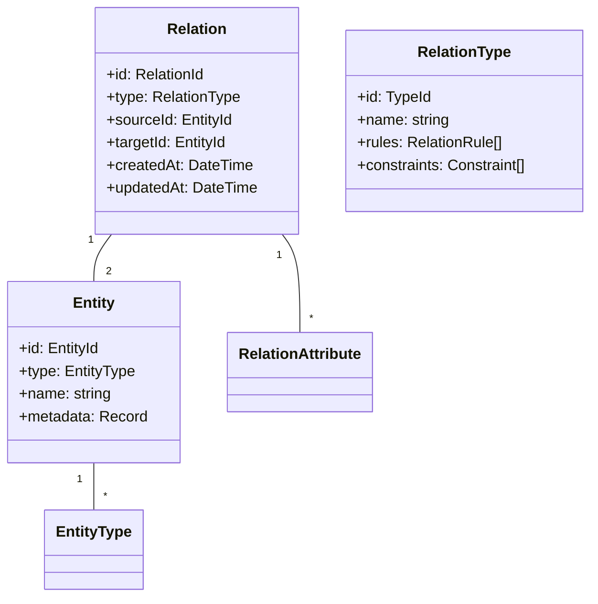
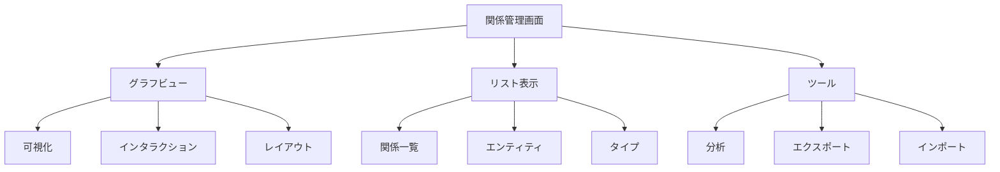

# 関係管理ユースケース

## ユースケース概要

システム内の様々なエンティティ間の関係を管理・可視化するためのユースケース。

## アクター

- [スタッフ]
- [システム]
- [グラフDB]

## 事前条件

- スタッフ権限を持っていること
- グラフDBが利用可能であること

## 基本フロー

### シナリオ：関係の分析と管理

システム管理者の田中誠は、システム内の様々なエンティティ間の関係を確認し、最適化しようとしています。

1. [スタッフ]は(RelationManagerConsole)にアクセス
2. [システム]は関係グラフを表示
3. [スタッフ]は対象エンティティを選択
   - 会員とグループの関係
   - 新聞と記事の関係
   - タグとカテゴリの関係
4. [グラフDB]は関係データを取得
5. [システム]は(GraphVisualizer)で表示
6. [スタッフ]は関係を分析・編集
7. [システム]は変更を保存

## 代替フロー

### A1. 関係の一括更新

3a. [スタッフ]は複数の関係を選択
4a. [スタッフ]は一括更新を指定
5a. [システム]は(BatchProcessor)で処理
6a. [グラフDB]に反映

### A2. パターン分析

3b. [スタッフ]は関係パターンを選択
4b. [システム]は(PatternAnalyzer)で分析
5b. [システム]は類似パターンを表示
6b. [スタッフ]は最適化を実施

## 例外フロー

### E1. 整合性エラー

6e. [システム]は整合性エラーを検出
7e. [システム]は(IntegrityChecker)で検証
8e. [スタッフ]は修正または中止

### E2. 循環参照

6e. [システム]は循環参照を検出
7e. [システム]は(CycleDetector)で分析
8e. [スタッフ]は修正方法を選択

## 事後条件

- 関係が更新されていること
- 整合性が保たれていること
- グラフDBが同期されていること

## 関連オブジェクト

- (Relation): 関係情報
- (Entity): エンティティ情報
- (RelationManager): 関係管理
- (GraphVisualizer): グラフ表示
- (IntegrityChecker): 整合性検証
- (PatternAnalyzer): パターン分析

## 補足資料

### データモデル



### バリデーションルール

1. 関係制約
   - 循環参照禁止
   - タイプ互換性
   - カーディナリティ

2. エンティティ制約
   - 存在性
   - タイプ整合性
   - 重複禁止

### イベント定義

```typescript
type RelationEvent = {
    type: "CREATE" | "UPDATE" | "DELETE";
    relationId: RelationId;
    timestamp: DateTime;
    data: {
        sourceId: EntityId;
        targetId: EntityId;
        relationType: RelationType;
        attributes?: Record<string, unknown>;
    };
    metadata: {
        actor: string;
        reason?: string;
        batch?: boolean;
    };
};
```

### グラフクエリ

```typescript
type GraphQuery = {
    // ノード検索
    findNodes: {
        type?: EntityType[];
        attributes?: Record<string, unknown>;
        limit?: number;
    };
    
    // パス検索
    findPaths: {
        source: EntityId;
        target: EntityId;
        maxDepth?: number;
        relationTypes?: RelationType[];
    };
    
    // パターンマッチ
    matchPattern: {
        pattern: RelationPattern;
        constraints?: QueryConstraint[];
    };
};
```

### UI レイアウト



### モニタリング

```mermaid
graph TD
    Monitor["モニタリング"]
    Integrity["整合性"]
    Performance["パフォーマンス"]
    
    Monitor --> Integrity
    Monitor --> Performance
    Monitor --> Alerts["アラート"]
    
    Integrity --> Check["チェック"]
    Integrity --> Fix["修正"]
    
    Performance --> Query["クエリ"]
    Performance --> Cache["キャッシュ"]
    
    Alerts --> Error["エラー"]
    Alerts --> Warning["警告"]
    Alerts --> Info["情報"]