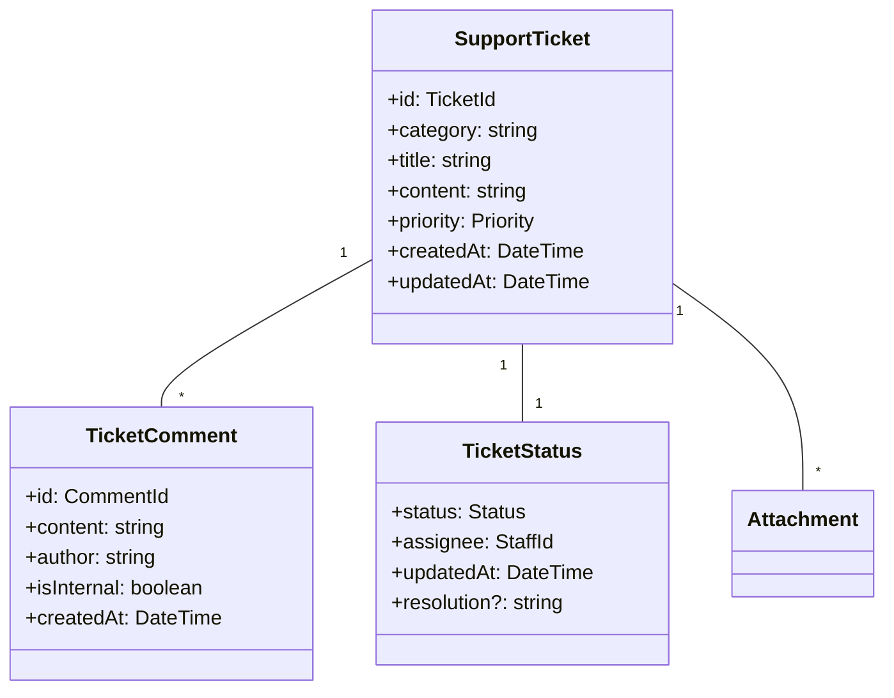
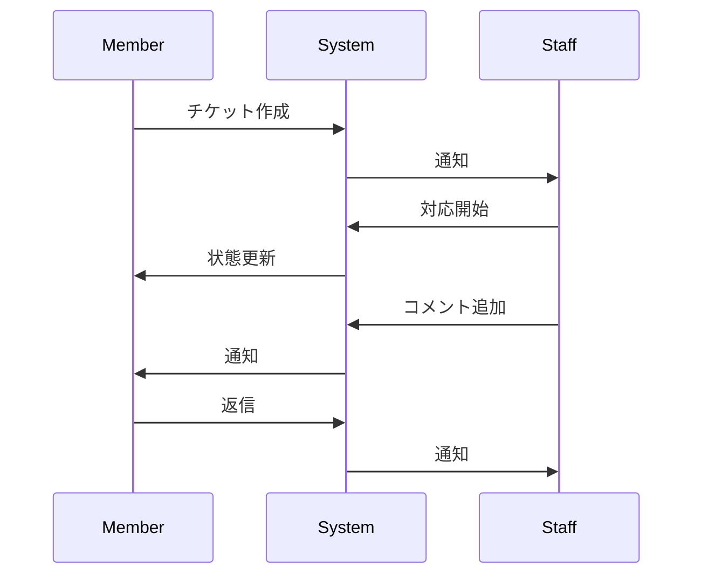
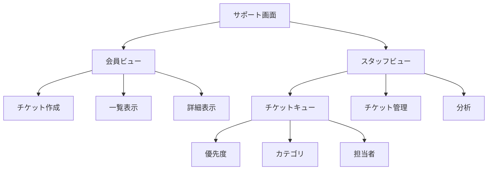

# 会員サポート管理ユースケース

## ユースケース概要

会員がサポートに問い合わせを行い、スタッフが対応するためのユースケース。

## アクター

- [会員]
- [サポートスタッフ]
- [システム]

## 事前条件

- 会員アカウントが有効であること
- サポートシステムが利用可能であること

## 基本フロー

### シナリオ：問い合わせと対応

会員の伊藤真由美は、ポイント利用について質問があり、サポートに問い合わせを行います。サポートスタッフの佐藤健太が対応します。

1. [会員]は(SupportPortal)から問い合わせを作成
2. [システム]は問い合わせフォームを表示
3. [会員]は以下を入力
   - カテゴリ選択
   - 問い合わせ内容
   - 添付ファイル（任意）
4. [システム]は(ValidationService)で検証
5. [システム]は(TicketManager)でチケット作成
6. [サポートスタッフ]が対応を開始
7. [システム]は進捗を追跡

## 代替フロー

### A1. FAQ参照

2a. [システム]は関連FAQを表示
3a. [会員]はFAQを確認
4a. 問題が解決した場合は終了
5a. 未解決の場合は基本フローの3に戻る

### A2. チケットのエスカレーション

6a. [サポートスタッフ]は上位者へエスカレート
7a. [システム]は(EscalationManager)で処理
8a. 上位者が対応を引き継ぎ

## 例外フロー

### E1. 入力エラー

4e. [システム]は入力エラーを検出
5e. [システム]はエラーメッセージを表示
6e. 基本フローの3に戻る

### E2. 添付ファイルエラー

3e. [会員]が不正なファイルを添付
4e. [システム]は(FileValidator)でエラー検出
5e. [システム]は警告を表示

## 事後条件

- サポートチケットが作成されていること
- 担当者が割り当てられていること
- 履歴が記録されていること

## 関連オブジェクト

- (SupportTicket): チケット情報
- (TicketStatus): 状態管理
- (TicketComment): コメント
- (TicketManager): チケット管理
- (EscalationManager): エスカレーション管理
- (FileManager): ファイル管理

## 補足資料

### データモデル



### バリデーションルール

1. チケット作成
   - タイトル：1-100文字
   - 内容：1-2000文字
   - 添付：最大5個、各10MB以下

2. 応答制限
   - 初回応答：24時間以内
   - 更新間隔：48時間以内

### イベント定義

```typescript
type SupportEvent = {
    type: "CREATE" | "UPDATE" | "COMMENT" | "ESCALATE" | "CLOSE";
    ticketId: TicketId;
    timestamp: DateTime;
    data: {
        status?: Status;
        comment?: string;
        assignee?: StaffId;
        priority?: Priority;
    };
    metadata: {
        actor: string;
        source: "member" | "staff";
        internal?: boolean;
    };
};
```

### サポートフロー



### UI レイアウト



### パフォーマンス指標

```mermaid
graph TD
    KPI["主要指標"]
    Response["応答時間"]
    Resolution["解決時間"]
    
    KPI --> Response
    KPI --> Resolution
    KPI --> Satisfaction["満足度"]
    
    Response --> First["初回応答"]
    Response --> Update["更新頻度"]
    
    Resolution --> Time["所要時間"]
    Resolution --> Rate["解決率"]
    
    Satisfaction --> Rating["評価"]
    Satisfaction --> Feedback["フィードバック"]