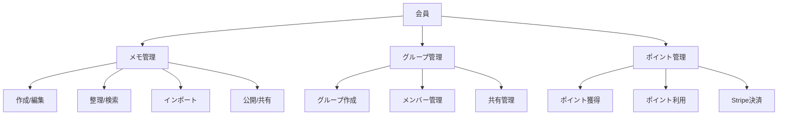

# メモ管理Webシステム - システム概要

## システムの目的
会員または会員グループでメモを管理、公開するWebシステムを提供し、ポイントシステムを通じて持続可能なサービス運営を実現します。

## 主要機能群

### 1. メモ管理機能
- メモの作成・編集・削除
- フォルダ構造による整理
- タグ付けと検索
- 外部サービスからのインポート
- バージョン管理とバックアップ

### 2. 共有・公開機能
- Web公開（公開設定の管理）
- 特定ユーザーとの共有
- グループでの共同編集
- 通知システム

### 3. グループ管理機能
- グループの作成・管理
- メンバー権限の設定
- グループリソースの共有
- グループ通知の管理

### 4. ポイントシステム
- ポイントの獲得・利用
- 有償ポイントの購入（Stripe決済）
- キャンペーン管理
- ポイント残高・履歴管理

## システム構成図

## ユーザーロール

### 一般会員
- メモの作成・管理
- 基本的な共有機能の利用
- ポイントの獲得・利用

### グループ管理者
- グループの作成・管理
- メンバー権限の設定
- グループリソースの管理

### システム管理者
- ポイントキャンペーンの管理
- システム全体の監視
- 不正利用の対応

## 技術構成

### フロントエンド
- モダンなWebフレームワーク
- リアルタイム更新
- レスポンシブデザイン

### バックエンド
- RESTful API
- WebSocket通信
- ファイルストレージ

### 外部サービス連携
- Stripe決済システム
- 外部メモサービスとの連携
- クラウドストレージ

### セキュリティ
- 認証・認可システム
- データ暗号化
- アクセス制御

## 将来の拡張性
- API公開による外部サービス連携
- モバイルアプリケーション対応
- AI機能の統合（メモの自動分類、要約生成など）
- ビジネス向けプラン提供