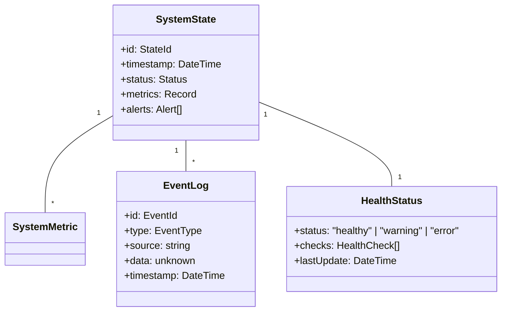
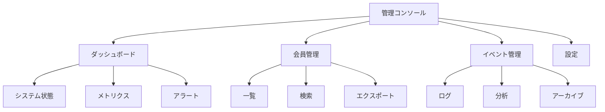

# システム管理ユースケース

## ユースケース概要

システム管理者がシステム全体の監視、会員管理、イベント履歴の確認を行うためのユースケース。

## アクター

- [システム管理者]
- [システム]

## 事前条件

- システム管理者権限を持っていること
- 管理コンソールにアクセス可能であること

## 基本フロー

### シナリオ：システム状態の確認

システム管理者の山田俊介は、システムの状態を確認し、必要な運用管理タスクを実行しようとしています。

1. [システム管理者]は(AdminConsole)にアクセス
2. [システム]は以下を表示
   - 会員一覧
   - システム状態
   - イベント履歴
   - 運用統計
3. [システム管理者]は会員データを確認
4. [システム]は(MemberManager)でデータ取得
5. [システム管理者]はイベント履歴を確認
6. [システム]は(EventLogger)で履歴表示
7. [システム]は状態を更新

## 代替フロー

### A1. 会員データのエクスポート

3a. [システム管理者]はエクスポートを選択
4a. [システム]は(DataExporter)で処理
5a. [システム]はファイルを生成
6a. [システム管理者]がダウンロード

### A2. イベント分析

5a. [システム管理者]は詳細分析を選択
6a. [システム]は(EventAnalyzer)で分析
7a. [システム]は分析結果を表示

## 例外フロー

### E1. データアクセスエラー

4e. [システム]はアクセスエラーを検出
5e. [システム]は(ErrorHandler)で処理
6e. [システム]はエラーを記録

### E2. 権限エラー

3e. [システム]は権限不足を検出
4e. [システム]は(AuthorizationManager)で処理
5e. [システム]は警告を表示

## 事後条件

- システム状態が確認されていること
- 必要なデータが取得できていること
- イベントが記録されていること

## 関連オブジェクト

- (AdminConsole): 管理コンソール
- (MemberManager): 会員管理
- (EventLogger): イベント記録
- (SystemMonitor): システム監視
- (DataExporter): データ出力
- (AuthorizationManager): 権限管理

## 補足資料

### データモデル



### バリデーションルール

1. アクセス制御
   - IP制限
   - 二要素認証
   - セッション管理

2. データ出力制限
   - 1回あたり10,000件
   - 時間帯制限
   - 頻度制限

### イベント定義

```typescript
type SystemEvent = {
    type: "STATE_CHANGE" | "ALERT" | "MAINTENANCE" | "BACKUP";
    systemId: SystemId;
    timestamp: DateTime;
    data: {
        state?: SystemState;
        metrics?: SystemMetric[];
        alerts?: Alert[];
    };
    metadata: {
        severity: "info" | "warning" | "error";
        source: string;
        actor?: string;
    };
};
```

### システム監視

```typescript
type Monitoring = {
    // メトリクス収集
    metrics: {
        cpu: number;
        memory: number;
        disk: number;
        network: {
            in: number;
            out: number;
        };
    };
    
    // ヘルスチェック
    health: {
        database: boolean;
        cache: boolean;
        queue: boolean;
        api: boolean;
    };
    
    // アラート
    alerts: Array<{
        id: string;
        type: string;
        message: string;
        severity: string;
    }>;
};
```

### UI レイアウト



### レポーティング

```mermaid
graph TD
    Reports["レポート"]
    System["システム"]
    Usage["利用状況"]
    Security["セキュリティ"]
    
    Reports --> System
    Reports --> Usage
    Reports --> Security
    
    System --> Performance["パフォーマンス"]
    System --> Health["健全性"]
    System --> Resources["リソース"]
    
    Usage --> Access["アクセス"]
    Usage --> Load["負荷"]
    Usage --> Storage["ストレージ"]
    
    Security --> Auth["認証"]
    Security --> Audit["監査"]
    Security --> Incident["インシデント"]