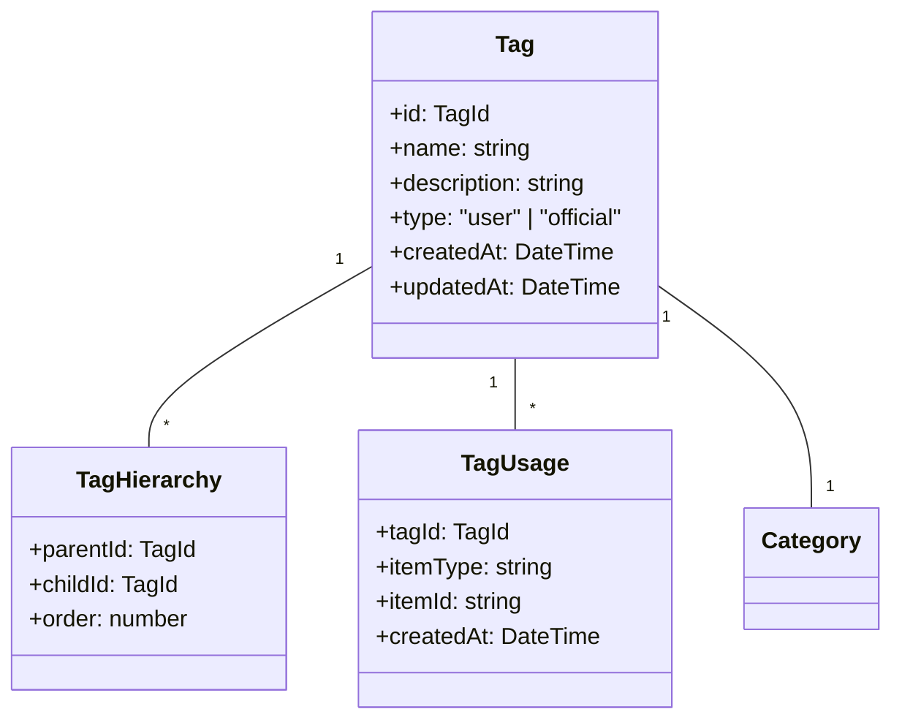
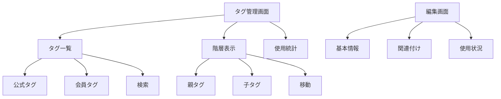

# タグ管理ユースケース

## ユースケース概要

会員とスタッフがタグを作成、管理、利用するためのユースケース。

## アクター

- [会員]
- [スタッフ]
- [システム]

## 事前条件

- アカウントが有効であること
- 適切な権限を持っていること

## 基本フロー

### シナリオ：公式タグの管理

スタッフの山本美咲は、テクノロジー関連の公式タグを整理し、新しいタグを追加しようとしています。

1. [スタッフ]は(TagManagerConsole)にアクセス
2. [システム]は現在のタグ一覧を表示
3. [スタッフ]は新規タグを作成
   - タグ名
   - 説明
   - カテゴリ関連付け
   - 表示順序
4. [システム]は(ValidationService)で検証
5. [システム]は(TagManager)で保存
6. [システム]は(IndexService)で検索更新
7. [システム]は完了を通知

## 代替フロー

### A1. タグの統合

3a. [スタッフ]は複数のタグを選択
4a. [スタッフ]は統合先タグを指定
5a. [システム]は(TagMerger)で統合処理
6a. [システム]は関連アイテムを更新

### A2. タグの階層化

3b. [スタッフ]は親タグを選択
4b. [スタッフ]は子タグを指定
5b. [システム]は(HierarchyManager)で処理
6b. [システム]は階層構造を更新

## 例外フロー

### E1. 重複タグ

4e. [システム]は重複を検出
5e. [システム]は(DuplicateHandler)で処理
6e. 基本フローの3に戻る

### E2. 使用中タグの削除

3e. [スタッフ]はタグの削除を試行
4e. [システム]は使用中を検出
5e. [システム]は警告を表示
6e. [スタッフ]は代替タグを指定

## 事後条件

- タグが更新されていること
- 関連アイテムが更新されていること
- インデックスが更新されていること

## 関連オブジェクト

- (Tag): タグ情報
- (TagHierarchy): タグ階層
- (TagUsage): 使用状況
- (TagManager): タグ管理
- (TagMerger): タグ統合
- (IndexService): 検索管理

## 補足資料

### データモデル



### バリデーションルール

1. タグ名
   - 長さ：1-50文字
   - 一意性：同一カテゴリ内
   - 禁止文字：特殊記号

2. 階層
   - 最大深さ：3階層
   - 循環参照禁止

### イベント定義

```typescript
type TagEvent = {
    type: "CREATE" | "UPDATE" | "DELETE" | "MERGE";
    tagId: TagId;
    timestamp: DateTime;
    data: {
        name?: string;
        description?: string;
        categoryId?: CategoryId;
        parentId?: TagId;
    };
    metadata: {
        actor: string;
        reason?: string;
        mergeTarget?: TagId;
    };
};
```

### タグ統合ロジック

```typescript
type TagMergeStrategy = {
    // 基本情報の統合
    info: {
        name: string;
        description: string;
        category?: CategoryId;
    };
    
    // 階層関係の処理
    hierarchy: {
        parentId?: TagId;
        children: TagId[];
    };
    
    // 使用箇所の更新
    usage: {
        items: Array<{
            type: string;
            id: string;
        }>;
        updateStrategy: "immediate" | "background";
    };
};
```

### UI レイアウト



### モニタリング

```mermaid
graph TD
    Monitor["モニタリング"]
    Usage["使用状況"]
    Trends["トレンド"]
    
    Monitor --> RealTime["リアルタイム"]
    Monitor --> Daily["日次"]
    Monitor --> Monthly["月次"]
    
    Usage --> Count["使用数"]
    Usage --> Items["アイテム"]
    Usage --> Users["ユーザー"]
    
    Trends --> Popular["人気タグ"]
    Trends --> New["新規タグ"]
    Trends --> Inactive["未使用タグ"]