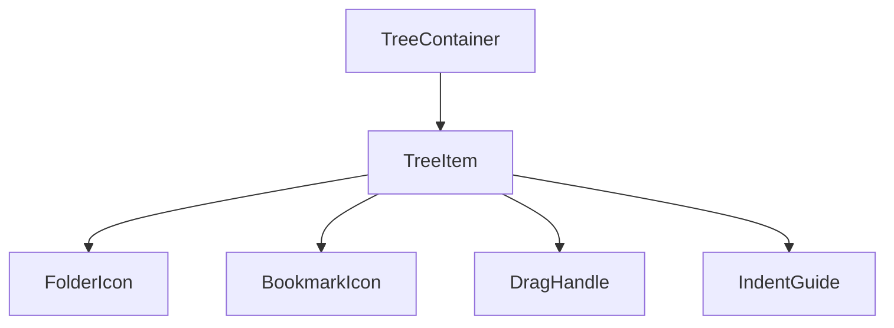

# ブックマークツリー表示の改善計画

## 実装ガイドライン準拠

### 型定義

```typescript
type TreeItemProps = {
  id: string
  name: string
  type: 'folder' | 'bookmark'
  depth: 0 | 1 | 2 | 3 | 4 | 5
  isExpanded?: boolean
  children?: React.ReactNode
  onToggle?: () => void
  onNameChange?: (newName: string) => void
  url?: string
  icon?: string
  description?: string
  tags?: string[]
}

type DragState = {
  sourceId: string | null
  targetId: string | null
}

type TreeContainerProps = {
  className?: string
}
```
### メモ化戦略

```typescript
// TreeItemのメモ化
const MemoizedTreeItem = memo(TreeItem, (prev, next) => {
  return (
    prev.id === next.id &&
    prev.name === next.name &&
    prev.isExpanded === next.isExpanded
  )
})

// ドラッグハンドラのメモ化
const handleDragStart = useCallback((event: DragStartEvent) => {
  // ...
}, [])
```

### アクセシビリティとキーボード操作

```typescript
const TreeItem = ({ id, name, type, isExpanded, onToggle }: TreeItemProps) => {
  return (
    <div
      role="treeitem"
      aria-expanded={type === 'folder' ? isExpanded : undefined}
      aria-label={`${type === 'folder' ? 'フォルダ' : 'ブックマーク'}: ${name}`}
      tabIndex={0}
      onKeyDown={(e) => {
        if (e.key === 'Enter' || e.key === ' ') {
          onToggle?.()
        }
      }}
    >
      {/* コンテンツ */}
    </div>
  )
}
```

### スタイリング戦略

```typescript
// Tailwindクラスの構造化
const baseClasses = {
  container: "relative transition-all",
  indent: (depth: number) => `pl-${depth * 6}`,
  item: "flex items-center gap-2 p-2 rounded-lg hover:bg-accent/50",
  dragHandle: "cursor-grab active:cursor-grabbing",
  icon: "flex-shrink-0 w-5 h-5",
  label: "flex-grow truncate",
  actions: "flex-shrink-0 opacity-0 group-hover:opacity-100"
}

// インデントラインのスタイリング
const IndentGuide = ({ depth }: { depth: number }) => {
  if (depth === 0) return null
  
  return (
    <div
      className="absolute left-0 h-full"
      style={{
        borderLeft: '1px solid var(--border)',
        marginLeft: `${(depth - 1) * 1.5}rem`
      }}
    />
  )
}
```

### テスト戦略

```typescript
describe('TreeItem', () => {
  it('フォルダの展開/折りたたみが正しく動作する', () => {
    const onToggle = vi.fn()
    render(
      <TreeItem
        id="1"
        name="テストフォルダ"
        type="folder"
        depth={0}
        isExpanded={false}
        onToggle={onToggle}
      />
    )

    const folderButton = screen.getByRole('button')
    userEvent.click(folderButton)
    expect(onToggle).toHaveBeenCalled()
  })

  it('キーボード操作が正しく動作する', () => {
    const onToggle = vi.fn()
    render(
      <TreeItem
        id="1"
        name="テストフォルダ"
        type="folder"
        depth={0}
        isExpanded={false}
        onToggle={onToggle}
      />
    )

    const treeItem = screen.getByRole('treeitem')
    treeItem.focus()
    fireEvent.keyDown(treeItem, { key: 'Enter' })
    expect(onToggle).toHaveBeenCalled()
  })
})
```

### パフォーマンス最適化

1. **仮想化の実装**
```typescript
import { Virtuoso } from 'react-virtuoso'

const TreeContainer = () => {
  return (
    <Virtuoso
      totalCount={items.length}
      itemContent={index => (
        <TreeItem
          key={items[index].id}
          {...items[index]}
        />
      )}
      components={{
        List: forwardRef((props, ref) => (
          <div {...props} ref={ref} role="tree" />
        ))
      }}
    />
  )
}
```

2. **状態更新の最適化**
```typescript
const useTreeOperations = () => {
  return useMemo(() => ({
    handleDragEnd: (event: DragEndEvent) => {
      // バッチ更新を使用
      batch(() => {
        updateTreeStructure(event)
        updateExpandedState(event)
      })
    }
  }), [])
}
```


## 概要

BookmarkViewのツリー表示UIを、dnd-kitのSortableTree.tsxを参考に改善する。

## 背景と目的

現在のツリー表示は基本的な機能は実装されているものの、視覚的な改善の余地がある。
特にインデントの表現やドラッグ&ドロップ時の視覚的フィードバックを改善することで、
よりユーザーフレンドリーなインターフェースを実現する。

## 技術的な要件

### コンポーネント構造



### 改善項目

1. インデントラインの追加
   - 垂直線によるインデントの視覚化
   - 適切な余白とスペーシング
   - アニメーションの追加

2. アイコンとインタラクションの改善
   - フォルダー展開/折りたたみアイコンの改善
   - ドラッグハンドルの追加
   - ホバー時の視覚的フィードバック

3. ドラッグ&ドロップの視覚的フィードバック
   - ドラッグ中のアイテムの表示
   - ドロップ可能な領域のハイライト
   - スムーズなアニメーション

### 技術スタック

- dnd-kit: ドラッグ&ドロップ機能
- shadcn/ui: UIコンポーネント
- framer-motion: アニメーション
- TailwindCSS: スタイリング

## 実装手順

1. TreeItemコンポーネントの改善
   - インデントラインの実装
   - アイコンコンポーネントの作成
   - ドラッグハンドルの追加

2. TreeContainerコンポーネントの改善
   - ドラッグオーバーレイのデザイン改善
   - アニメーションの追加
   - ドロップ領域のビジュアル改善

3. スタイリングとアニメーション
   - Tailwindユーティリティの活用
   - framer-motionアニメーションの追加
   - アクセシビリティの考慮

4. テストとドキュメント
   - コンポーネントのテスト追加
   - アクセシビリティテスト
   - ドキュメントの更新

## タイムライン

1. フェーズ1: TreeItem改善（2時間）
2. フェーズ2: TreeContainer改善（2時間）
3. フェーズ3: アニメーション追加（1時間）
4. フェーズ4: テストとドキュメント（1時間）

## 成功基準

1. 視覚的な改善
   - インデントラインの明確な表示
   - スムーズなアニメーション
   - 一貫性のあるデザイン

2. 機能的な改善
   - ドラッグ&ドロップの使いやすさ向上
   - パフォーマンスの維持
   - アクセシビリティの確保

## リスクと対策

1. パフォーマンス
   - 大量のアイテムがある場合の対応
   - アニメーションの最適化

2. ブラウザ互換性
   - クロスブラウザテスト
   - フォールバックの実装

3. アクセシビリティ
   - キーボード操作の確保
   - スクリーンリーダー対応

## 参考資料

- [dnd-kit SortableTree example](https://github.com/clauderic/dnd-kit/blob/master/stories/3%20-%20Examples/Tree/SortableTree.tsx)
- [shadcn/ui documentation](https://ui.shadcn.com/)
- [framer-motion documentation](https://www.framer.com/motion/)