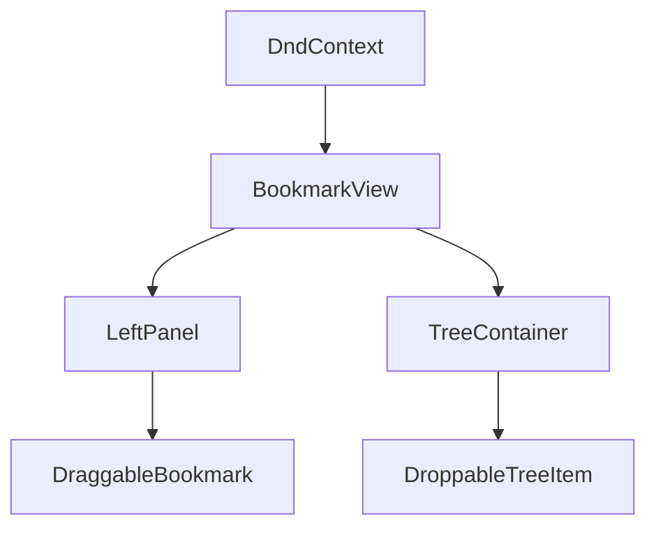
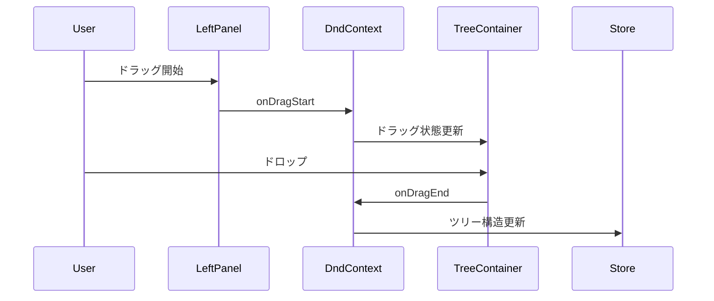

# パネル間ドラッグ&ドロップ機能の実装計画

## 概要

BookmarkViewにおいて、左パネルのブックマークリストから右パネルのツリービューへの
ドラッグ&ドロップ機能を実装する。

## 技術的な要件

### コンポーネント構造



### データフロー



### 実装手順

1. BookmarkViewの拡張
   - DndContextの追加
   - パネル間のドラッグ&ドロップ状態管理
   - ドラッグ中の視覚的フィードバック

```typescript
type DragState = {
  type: 'bookmark' | 'tree';
  sourceId: string;
  targetId: string | null;
};

const BookmarkView = () => {
  const [dragState, setDragState] = useState<DragState | null>(null);
  // ...
};
```

2. 左パネルのドラッグ機能
   - DraggableBookmarkコンポーネントの作成
   - ドラッグ開始のハンドリング
   - ドラッグ中の視覚的フィードバック

```typescript
const DraggableBookmark = ({ bookmark }: { bookmark: BookmarkType }) => {
  const { setNodeRef, listeners, ... } = useDraggable({
    id: bookmark.id,
    data: { type: 'bookmark' }
  });
  // ...
};
```

3. 右パネルのドロップ機能
   - TreeItemのドロップ受け入れ実装
   - ドロップ位置の検出
   - ツリー構造の更新処理

```typescript
const DroppableTreeItem = ({ item }: { item: TreeItemType }) => {
  const { setNodeRef, isOver } = useDroppable({
    id: item.id,
    data: { type: 'tree' }
  });
  // ...
};
```

4. 状態管理の実装
   - ツリー構造の更新ロジック
   - 最適化された再レンダリング
   - エラーハンドリング

```typescript
const useBookmarkOperations = () => {
  const addBookmarkToTree = (bookmarkId: string, targetId: string) => {
    // ツリー構造の更新ロジック
  };
  // ...
};
```

### テスト計画

1. ユニットテスト
   - コンポーネントの個別テスト
   - ドラッグ&ドロップロジックのテスト
   - エラー状態のテスト

2. 統合テスト
   - パネル間の相互作用テスト
   - 状態更新の整合性テスト
   - エッジケースの検証

### エラーハンドリング

1. 想定されるエラー
   - ドラッグ&ドロップの中断
   - 無効なドロップ位置
   - 状態更新の失敗

2. エラー対応
   - ユーザーへのフィードバック
   - 状態の復元
   - エラーログの記録

## 成功基準

1. 機能要件
   - 左パネルから右パネルへのドラッグ&ドロップが可能
   - ドロップ時に適切な位置に配置される
   - 視覚的なフィードバックが提供される

2. 非機能要件
   - パフォーマンスの維持
   - エラー時の適切な処理
   - アクセシビリティの確保

## タイムライン

1. フェーズ1: 基本実装（2時間）
   - DndContextの設定
   - 基本的なドラッグ&ドロップ機能

2. フェーズ2: 視覚的フィードバック（1時間）
   - ドラッグ中の表示
   - ドロップ可能領域の表示

3. フェーズ3: 状態管理とエラー処理（2時間）
   - ツリー構造の更新
   - エラーハンドリング

4. フェーズ4: テストと最適化（1時間）
   - テストの実装
   - パフォーマンス最適化

## 参考資料

- [dnd-kit documentation](https://docs.dndkit.com/)
- [React state management best practices](https://reactjs.org/docs/hooks-state.html)
- [Testing drag and drop in React](https://testing-library.com/docs/example-drag-drop/)